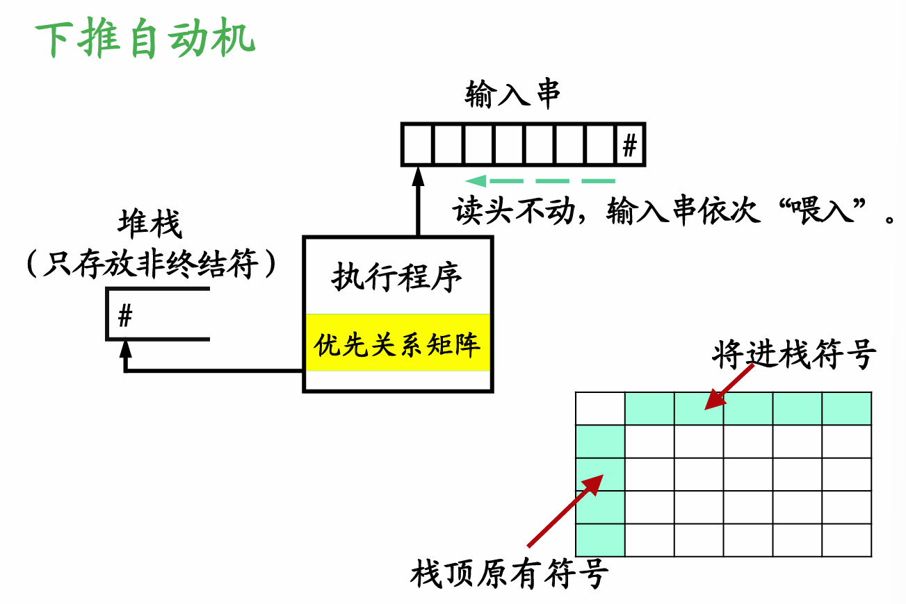
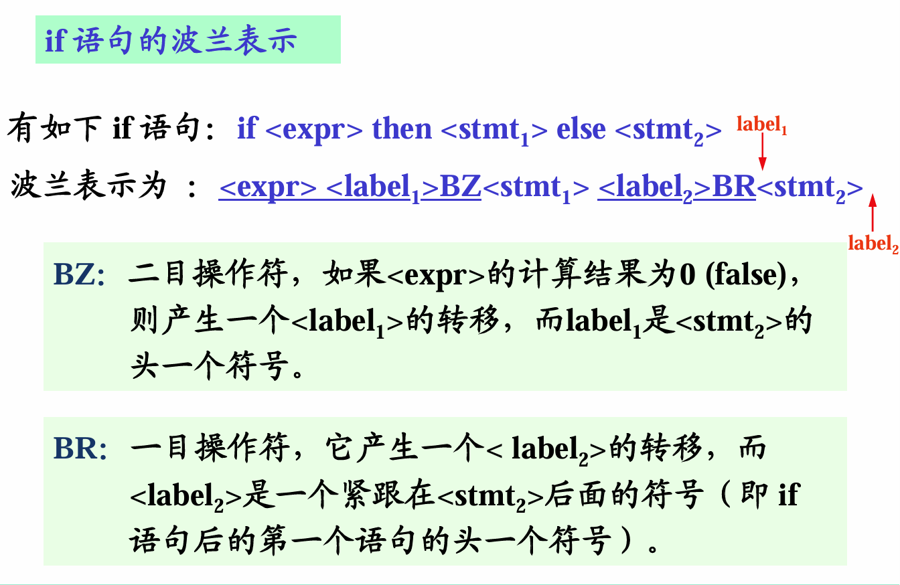
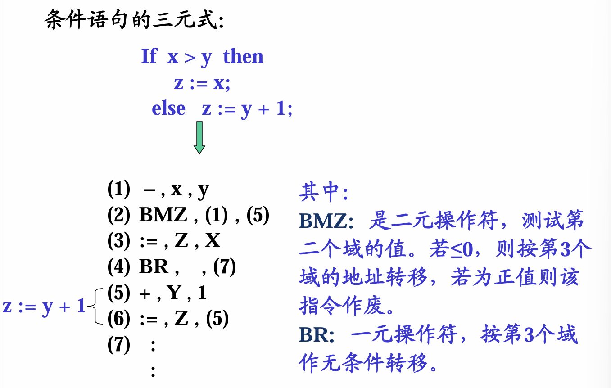
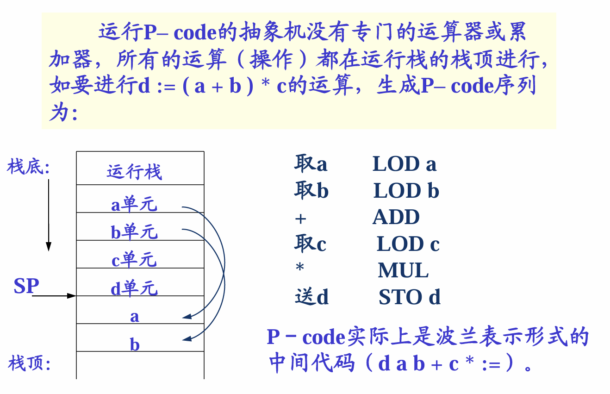
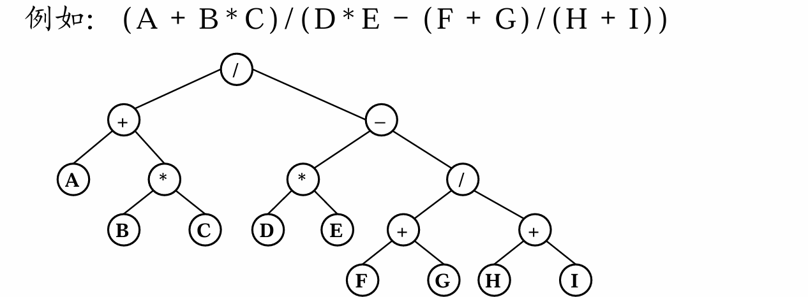
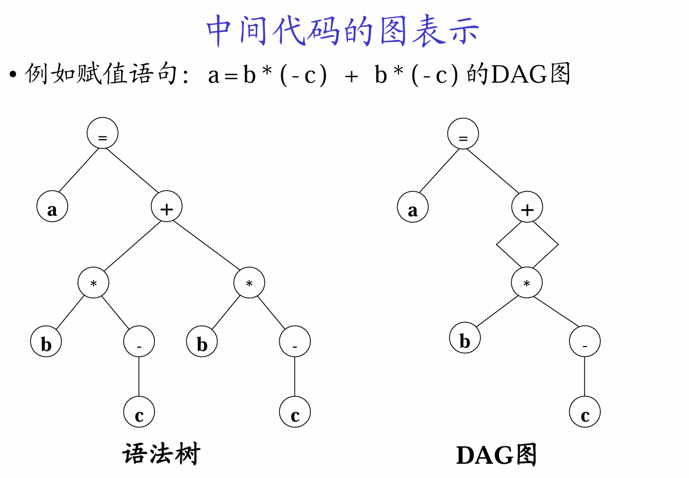
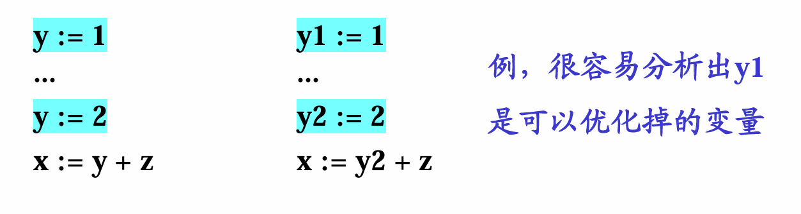
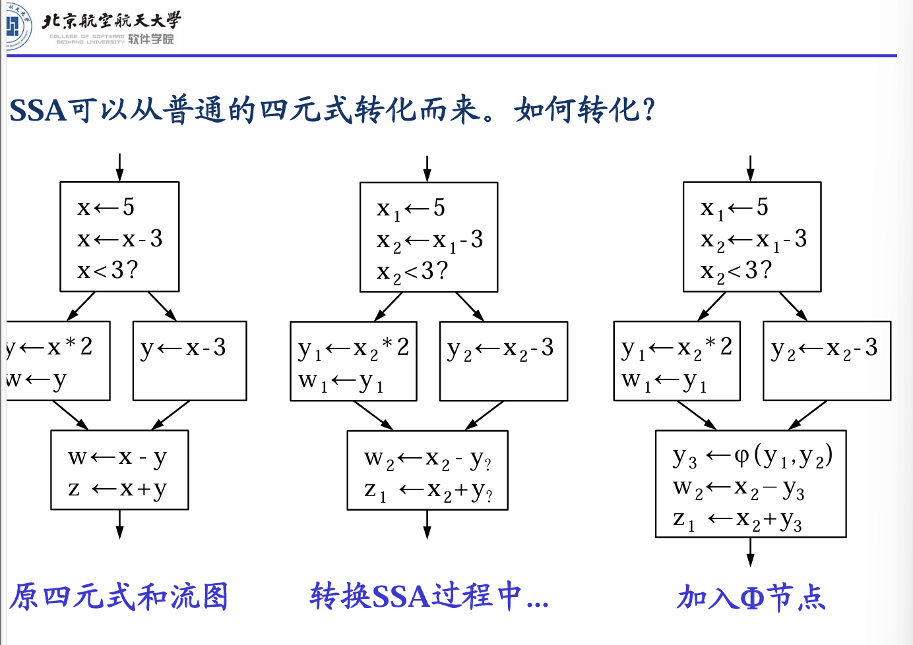
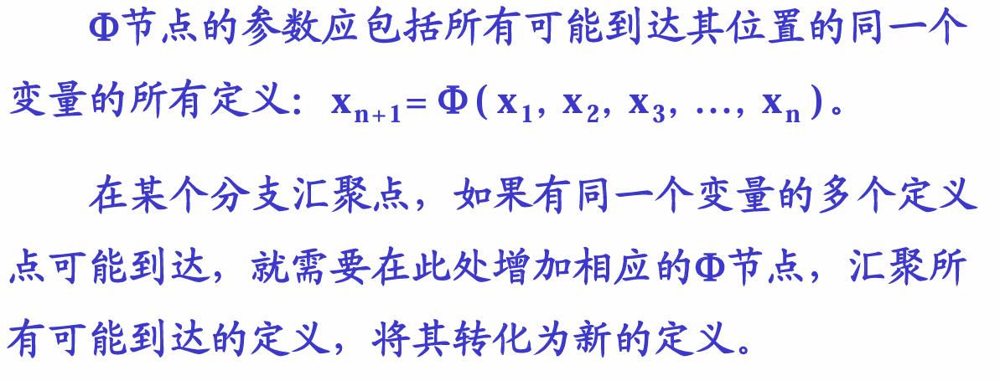

# 源程序的中间形式

m种源语言，n种目标代码
有中间程序，需要m+n个编译器
没有中间程序，需要mn个编译器
提高**可移植性**和易于**代码优化**。

## 1、波兰表示

### 1.1、表达式的波兰表示

算术表达式： F * 3.1416 * R * ( H + R ) 中缀表示（中序遍历）
转换成如波兰表示：F 3.1416 * R * H R + *
波兰表示法运算符出现顺序就是运算的顺序。
下推自动机比有穷自动机多一个栈。

**设立一个操作符栈，只放操作符不放操作数。当读到操作数时，就立即输出该操作数；当遇到操作符时，则要与栈顶操作符比较优先级，若栈顶操作符优先级高于栈外，则输出该栈顶操作符；反之，则栈外操作符入栈。**
一般可以在左右各加入一个#，一旦两者碰头，代表已经处理结束。
赋值号优先级最低。

a代表左侧，b代表右侧。对于左上角第一个，意思是左侧的+优先级大于右侧的+
表达式中不存在“）（”的情况，所以这时的优先关系不存在。
相等的操作符（左括号和右括号）相遇时，两者直接消除，不用输出。

**波兰表示法的优点**：
1. 在不使用括号的情况下可以无二义地说明算术表达式。
2. 波兰表示法更容易转换成机器的汇编语言或机器语言。
**操作数出现在紧靠操作符的左边，而操作符在波兰表示中的顺序即为进行计算的顺序。**
3. 波兰表示不仅能用来作为算术表达式的中间代码形式，而且也能作为其它语言结构的中间代码形式。

波兰表达式计算方式：将操作数压入一个栈，遇到操作符后弹出栈顶两个元素。所有操作只涉及栈顶。

### 1.2、if语句波兰表示

## 2、N元表示
### 2.1、三元式

操作符 左操作数 右操作数

极不适用于优化，删除三元式导致结果编号的更改
间接三元式将执行顺序和三元式编号分离

三元式的执行次序用另一张表表示，这样在优化时（三元式位置的变更实际是执行顺序的变化），三元式可以不变，而仅仅改变其执行顺序表。

### 2.2、四元式表示

操作符  操作数1  操作数2   结果

结果：通常是编译时分配的临时变量，可由编译程序分配一个寄存器或主存单元。
寄存器速度远高于内存。

寄存器优化：事实上T3，T4都可以用T1进行运算，节约两个寄存器。

## 3、抽象机代码

P-code抽象代码。Pseudo：“伪”
既然是“抽象机”，就是表示它并不是实际的物理目标机器，而通常是虚拟的一台“堆栈计算机”。该堆栈式计算机主要由若干寄存器、一个保存程序指令的储存器和一个堆栈式数据及操作存储组成。

d是地址，a，b，c是值。

## 4、其它表示
### 4.1、AST抽象语法树表示
LLVM IR用这种方式。
二目运算符比较多，所以采用二叉树

中序遍历就是表达式；后序遍历是波兰表达式。
### 4.2、DAG有向无环图表示

### 4.3、一种特殊的四元式表达方式：SSA
静态单一赋值形式的IR 主要特征是**每个变量只赋值一次**。
SSA的优点：
1）可以简化很多优化的过程；
2）可以获得更好的优化结果。

**SSA的关键问题――如何加入$\phi$节点？**

