# 第三章 词法分析
## 词法分析程序的功能及实现方案
词法分析程序的功能
- 词法分析：根据词法规则识别及组合单词，进行词法检查。
对数字常数完成数字字符串到（二进制）数值的转换。
删去空格字符和注解。

凡是带“#”的语句都是预处理语句，给编译器用，预编译后替换。
**关键字是保留字的子集**；比如java中，goto不能用，但也是保留字。关键字应当是能够使用的。
**保留字是标识符的子集**
程序员能够起名的，叫标识符
非空字符：空格，制表符等；
计算机四类单词：保留字，标识符，所有常量，分界符

**实现方案**：
1. 单独作为一遍：一次取完所有单词串
2. 作为单独的子程序：由语法分析负责取单词，词法分析提供单词。

## 单词的种类及词法分析程序的输出形式

单词的种类
1. 保留字：begin、end、for、do…
2. 标识符：
3. 常数：无符号数、布尔常数、字符串常数等
4. 分界符：+、-、*、/
只有标识符和常数需要进入符号表。

基本上单词是二元组；第一个是类型，第二个是对应的值。
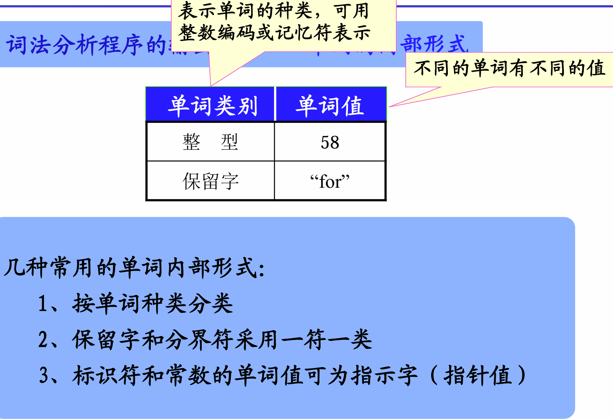
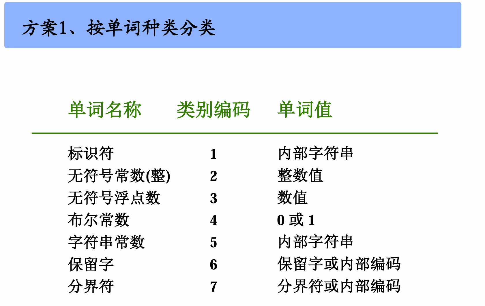
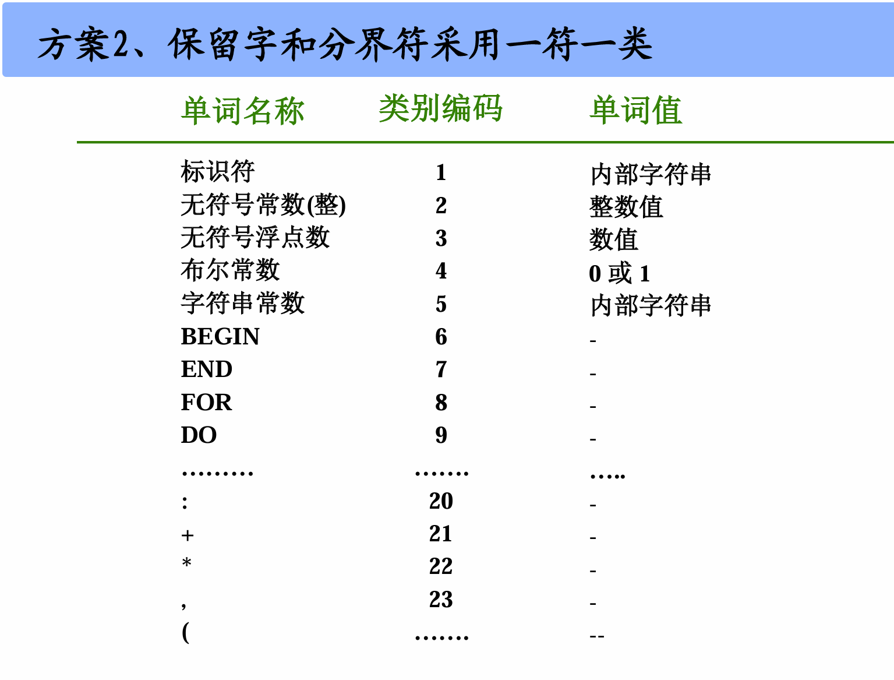
一般用第二个，“一符一类”。

## 正则文法和状态图
### 1、状态图的画法（根据文法画出状态图）

例如：正则文法
Z::= U0 | V1
 U ::=Z1 | 1
 V ::=Z0 | 0
左线性文法
L(G[Z]) = { $B^n$ | n>0 },  其中 B = 01 | 10

正则文法可以被有穷状态自动机所接受
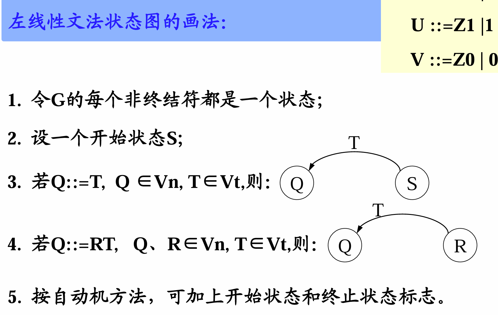
注意3和4的区别
**3相当于“开始状态加一个T终结符，就能到Q”
4相当于“状态R加一个终结符T，就能到Q”**
状态数量等于Vn数量+1；终结符不作为状态。
**结束状态用双圆圈表示**
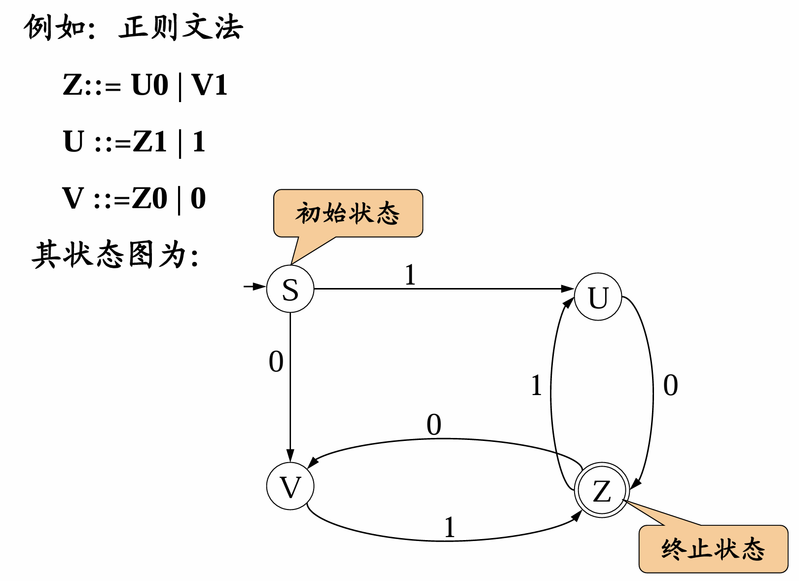

### 2、识别算法（自然语言描述）

利用状态图可按如下步骤分析和识别字符串x：
1、置初始状态为当前状态，从x的最左字符开始，重复步骤2，直到x右端为止。
2、扫描x的下一个字符，在当前状态所射出的弧中找出标记有该字符的弧，并沿此弧过渡到下一个状态；
如果找不到标有该字符的弧，那么x不是句子，过程到此结束；
如果扫描的是x的最右端字符，并从当前状态出发沿着标有该字符的弧过渡到下一个状态为终止状态Z，则x是句子。
例：x=01101 和1011

这个自动机是自底向上。初始给出一个句子，最终规约到Z处。
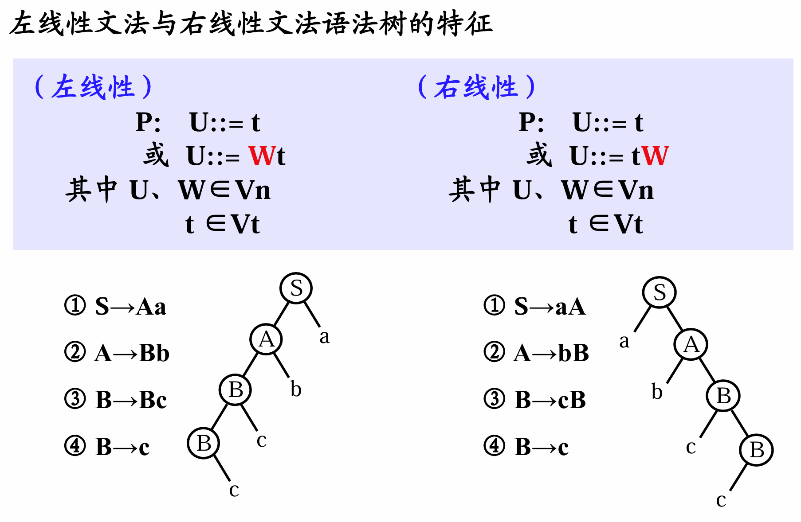

## 词法分析程序的设计与实现
### 1、文法及其状态图
语言的单词符号

    标识符
    保留字（标识符的子集）
    无符号整数
    单分界符+、*、：、，（、）
    双分界符:=

两点说明：
1、注释符号/* 和*/ 以及//。词法分析程序不输出注释！
2、各单词之间用空白符号（空格、制表、回车）分开。
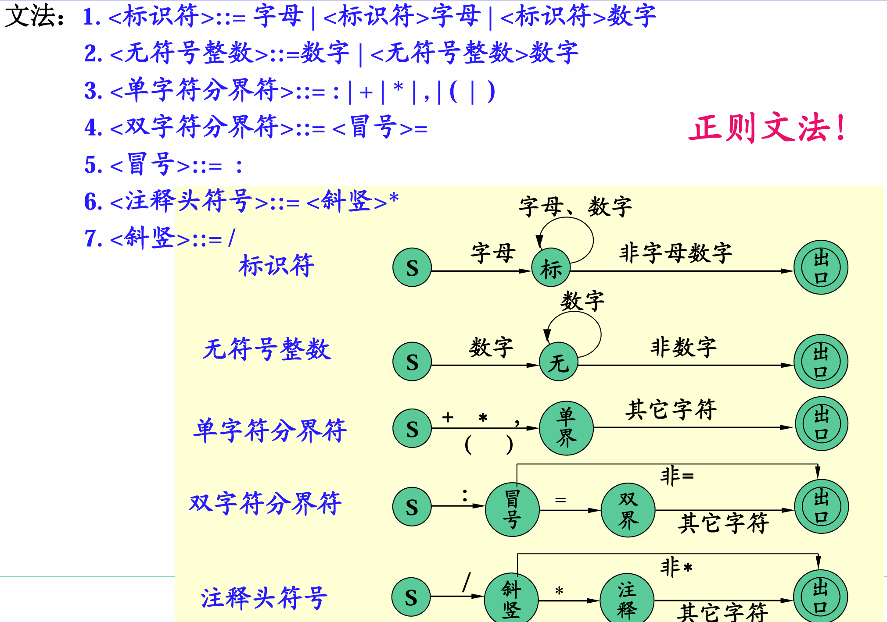
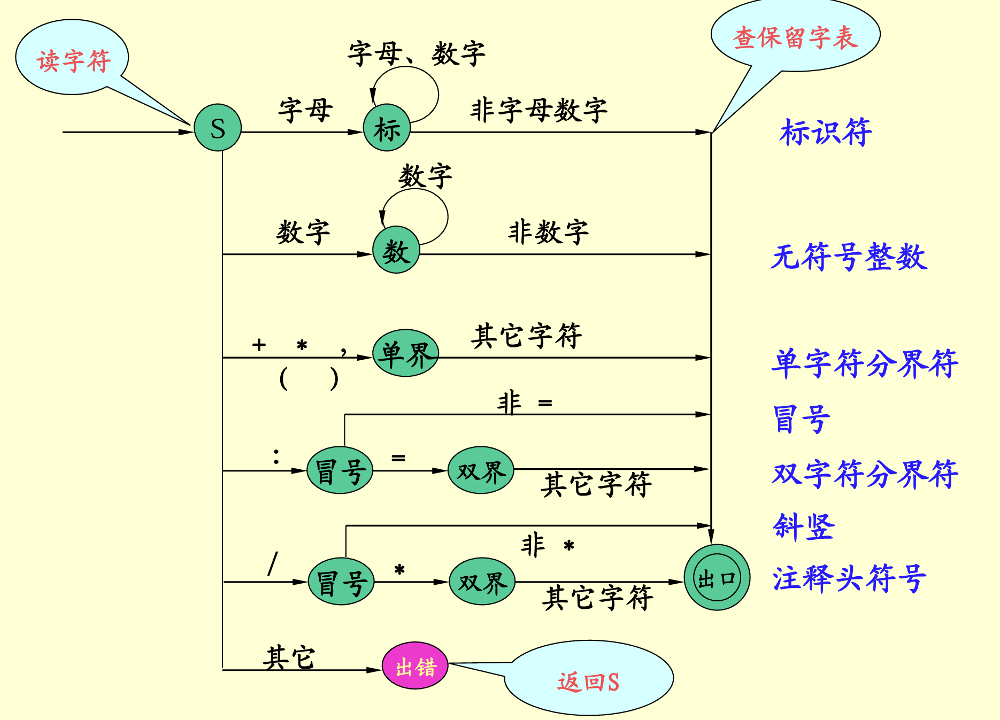
由于保留字是标识符的子集，所以得到标识符后先去查保留字表。
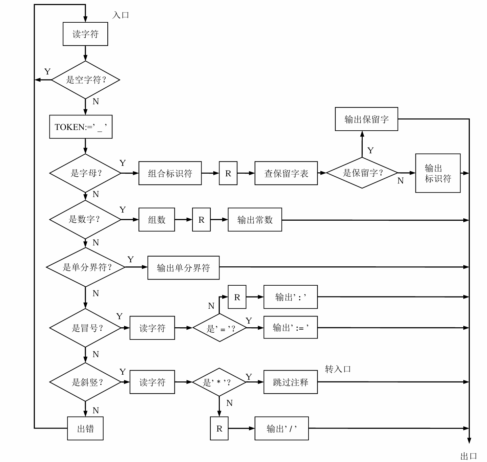
TOKEN原则上初始时应赋值为null
注：当判断出来一种符号结束时，指针记得回退一位，比如
printf(a)，判断出printf时指针在'('处。

在组合字母和数字处也有读字符的部分。

### 2、状态图的实现――构造词法分析程序

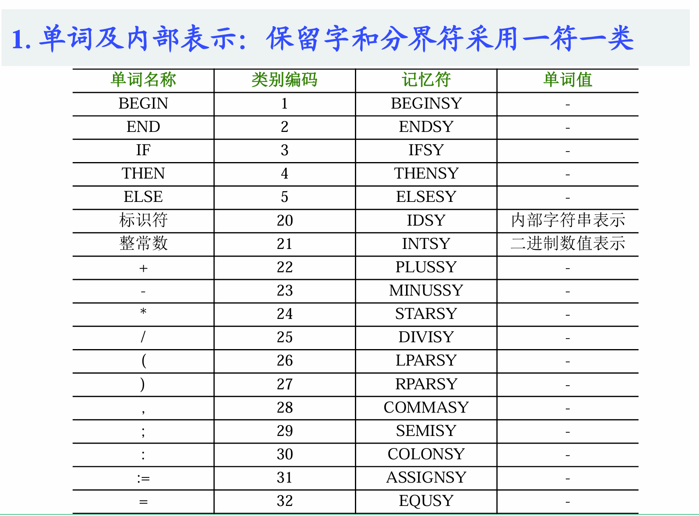
一符一类只需告诉编码
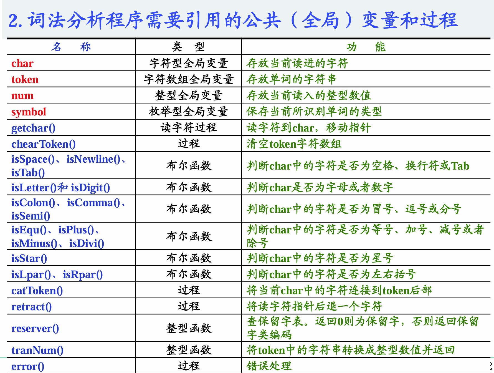
有返回值叫函数，没有返回值叫过程。
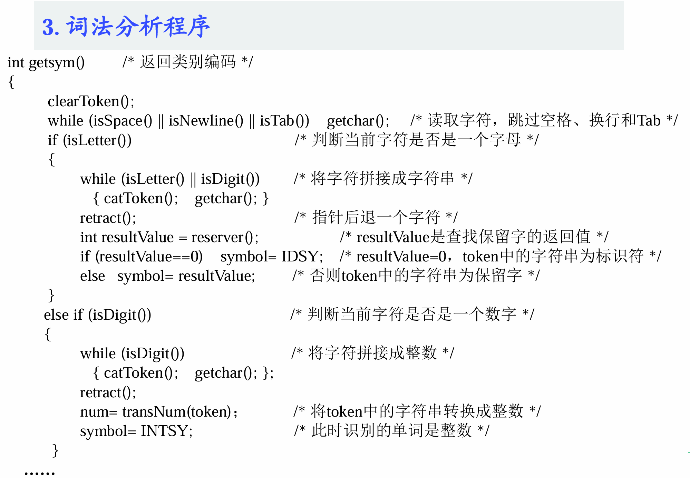
**指针后退一个字符是一个很重要的技巧**