# 语法制导翻译技术

程序语言的语义形式化描述目前有三种基本描述方法，
即形式语义学分成三类：
? 操作语义学（着重模拟数据加工过程中计算机系统的操作）
? 指称语义学（主要描述数据加工的结果而不是加工过程的细节）
? 公理语义学（用公理化的方法模拟程序对数据的加工）

## 1、翻译文法和语法制导翻译

@为动作符号标记，其后为字符串。
在该具体例示中，其对应语义子程序的功能是要输出打印动作符号标记后面的字符串。
动作标记的添加凭经验决定。

**输入文法：未插入动作符号时的文法。**
由输入文法可以通过推导产生输入序列。
**翻译文法：插入动作符号的文法。**
由翻译文法可以通过推导产生活动序列
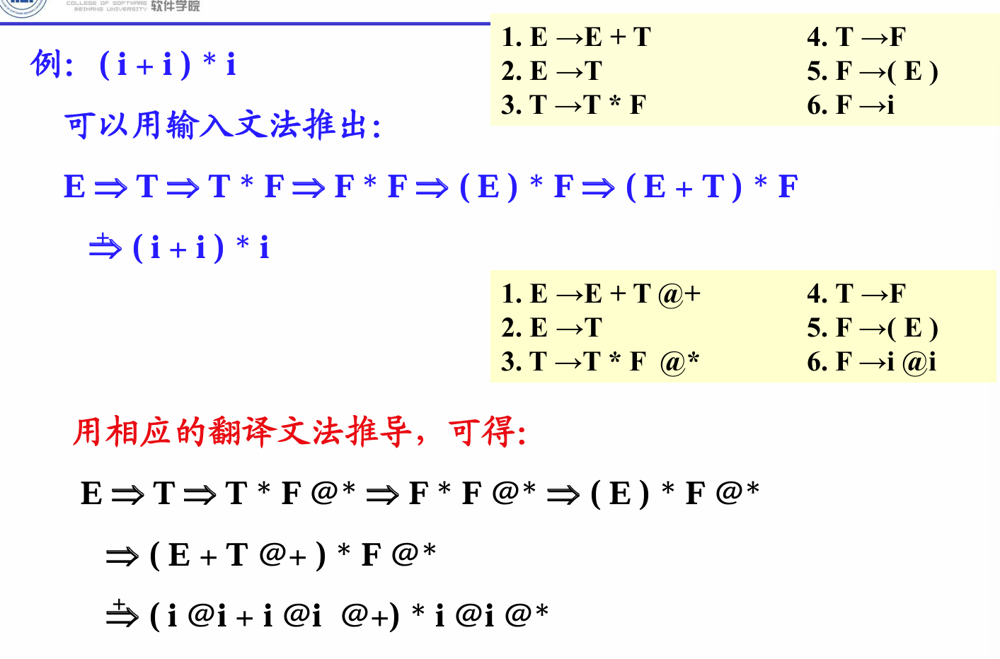

将所有@和后面的一个单词，全部去掉，就是输入序列

活动序列：由翻译文法推导出的符号串，由终结符和动作符号组成。
( i @i + i @i  @+ ) * i @i @*
●从活动序列中，抽去动作符号则得输入序列（i + i） * i
●从活动序列中，**抽去输入序列，则得动作序列**。**执行动作序列，则完成翻译任务**：
@i @i @+ @i @* -> i i + i *

定义9.1  
翻译文法是上下文无关文法，终结符号集由输入符号和动作符号组成。
由翻译文法所产生的终结符号串称为活动序列。

**符号串翻译文法**：输入文法中的动作符号对应的语义子程序
是输出动作符号标记@后的字符串的文法。

**语法制导翻译**：按翻译文法进行的翻译
给定一输入符号串，根据翻译文法获得翻译该符号串的动作序列，并执行该序列所规定的动作过程。

**实现方法**：
在文法的适当位置插入语义动作符号。当按文法分析到动作符号时就调用相应的语义子程序，完成翻译任务。
翻译文法所定义的翻译是由输入序列和动作序列组成的对偶集。

## 2、属性翻译文法

翻译文法中的符号，包括终结符、非终结符和动作符号均可带有属性，这样能更好地描述和实现编译过程。
也可以不带有属性

基本上分为两种：综合属性，继承属性。

### 2.1、综合属性($\uparrow$)

其中 $\uparrow$ C 是综合属性符号，$\uparrow$ 为综合属性标记，c为属性变量或者属性值。
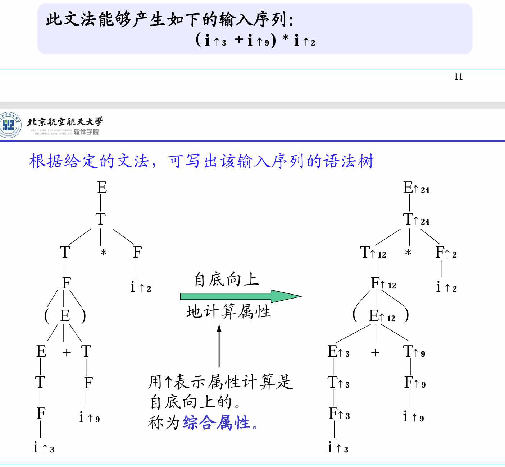
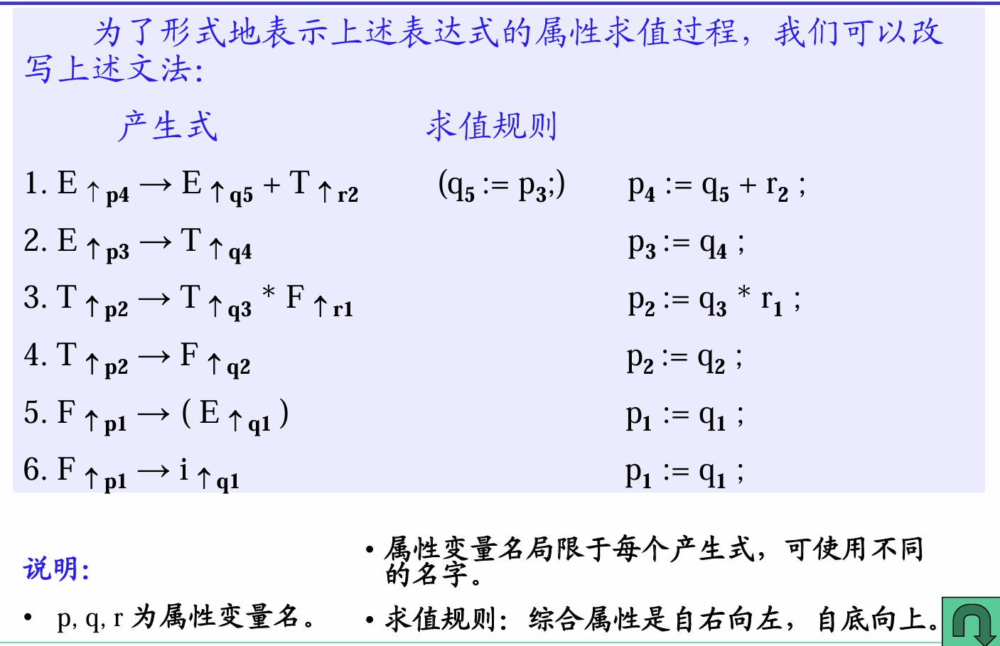

### 2.2、继承属性($\downarrow$)

考虑到下列文法：G [<说明>]：
1. <说明> → Type  id  <变量表>
2. <变量表> → ，id  <变量表>
3. <变量表> → ε

Type: 类型名，值为integer, real, boolean等，词法分析程序返回的类型的类别码。
id： 变量（值：标识符本身）

对于上述文法的说明语句：integer  A, B1 
该文法的翻译任务：将声明的变量填入符号表（语义）完成该工作的动作符号：@set_table

翻译文法：
1. <说明> → Type id @set_table  <变量表>
2. <变量表> → , id @set_table  <变量表>
3. <变量表> → ε

终结符（输入符号）的类型和名字在词法分析时得到，可设两个综合属性。
Type $\uparrow$t， t 中是类型值
id $\uparrow$n， n 是变量名

填表动作符号也可带有属性：
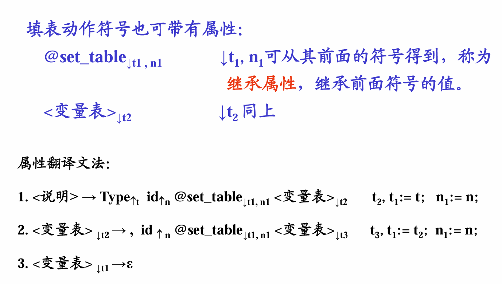

**继承属性可以从上面来，也可以从左边来。**

**综合属性从底向上，从右向左。**

### 2.3、属性文法的自顶向下翻译

**如果A能推出ε，那么递归向下子程序法必须要求FIRST(A)与FOLLOW(A)不相交。**

(一) L-属性翻译文法（L-ATG）
这是属性翻译文法中较简单的一种。其输入文法要求是LL(1)文法，可用自顶向下分析方法构造分析器。在分析过程中可进行属性求值。

**LL(1)文法就是递归下降子程序要求的文法。**
**满足LL(1)可以无回溯递归下降**

特点：
**某个符号的继承属性只依赖于该符号左边的信息**！

**定义9.2**:
 L-属性翻译文法是带有下列说明的翻译文法：
1. 文法中的终结符，非终结符及动作符号都带有属性，且每个属性都有一个值域。
2. 非终结符及动作符号的属性可分为继承属性和综合属性。（终结符不能同时有综合属性和继承属性）
3. 开始符号的继承属性具有**指定的初始值**。
4. 输入符号（终结符号）的**每个综合属性具有指定的初始值**。
5. 属性值的求值规则如下：
**继承属性――体现自顶向下，自左向右的求值特性**。
①产生式左部非终结符号的继承属性值，取前面产生式右部该符号已有的继承属性值。
②产生式右部符号的继承属性值，用该产生式左部符号的继承属性或出现在该符号左部的符号的属性值进行计算。

例如:A->BC，B->DE, D->FG
则**B的继承属性来自于C (判断1)，E的继承属性来自于B或D (判断2)**

**综合属性――体现自底向上，自右向左的求值特性。**
①产生式右部非终结符号的综合属性值，取其下部产生式左部同名非终结符号的综合属性值。
②产生式左部非终结符号的综合属性值，用该产生式左部符号的继承属性或某些右部符号的（任意）属性进行计算。
③动作符号的综合属性用该符号的继承属性或某些右部符号的（任意）属性进行计算。适合在自顶向下分析过程中求值。

有些时候，继承属性也会变成综合属性继续传。

**注意**：
1) 终结符只有综合属性（它们由词法分析器提供）。
2) 非终结符和动作符号既可以有综合属性也可有继承属性。
3) 文法开始符号的所有继承属性作为属性计算前的初始值。

属性求值规则中只能使用相应产生式中的文法符号的属性（这有助于在产生式范围内“封装”属性的依赖性）。

(二) 简单赋值形式的L-属性翻译文法(SL-ATG)
?一般情况x := f ( y , z ) x的属性值是y和z的属性值的函数
? SL-ATG:           x := 某符号的属性值或常量
例x := y         x, y, z := 17     ――称为复写规则

定义9.4  一个L-ATG被定义为简单赋值形式的(SL-ATG)，当且仅当满足如下条件:
1. 产生式右部符号的继承属性是一个常量，它等于左部符号的继承属性值，或等于出现在所给符号左部某个符号的综合属性值。
2. 产生式左部非终结符号的综合属性是一个常量，它等于其自身的继承属性值或等于右部某个符号的综合属性值。

## 3、自顶向下语法制导翻译

### 3.1、翻译文法的自顶向下翻译――递归下降翻译器

按翻译要求，在文法中插入语法动作符号，在分析过程中调用相应的语义处理程序，完成翻译任务。
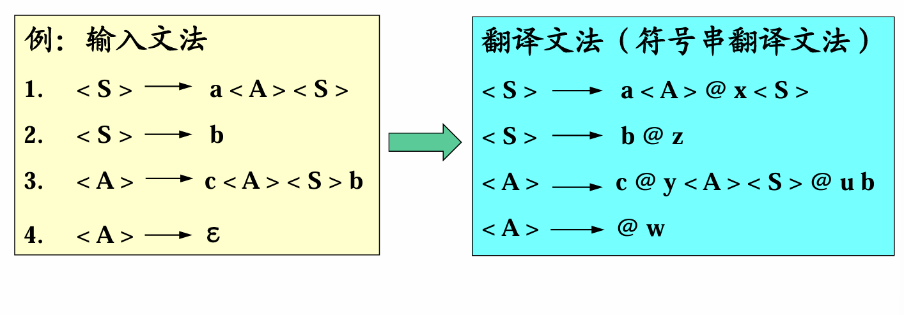
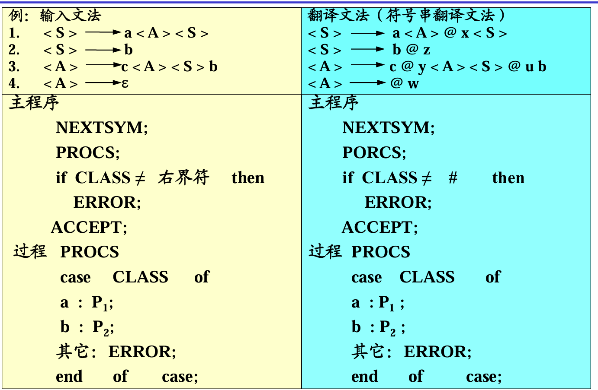
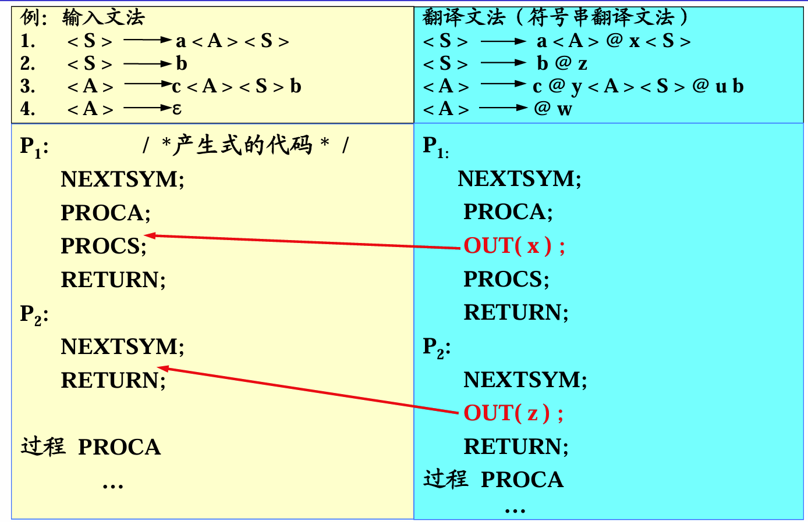

### 3.2、属性文法自顶向下翻译的实现――递归下降翻译

把处理翻译文法的递归下降翻译器进行适当扩展，便可得到处理属性（翻译）文法的递归下降翻译器。

方法：
对于每个非终结符号都编写一个翻译子程序（过程）。根据该非终结符号具有的属性数目，设置相应的参数。
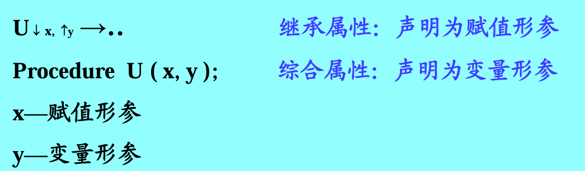

过程调用语句的实参：
**继承属性:  继承属性值（传实参值）**
**综合属性:  属性变量名（传地址，返回时有值）**

**关于属性名的约定：**
1)  具有相同值的属性取相同的属性名。（这样可省去不少属性求值规则）
2)  产生式左部的同名非终结符使用相同的属性名。
（**递归下降分析法规定每个非终结符只编写一个子程序**!）
具有简单赋值形式的属性变量名取相同的属性名，可删去属性求值规则。
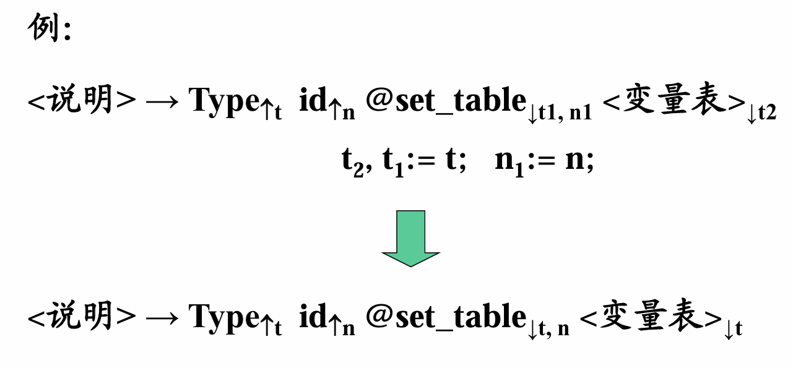
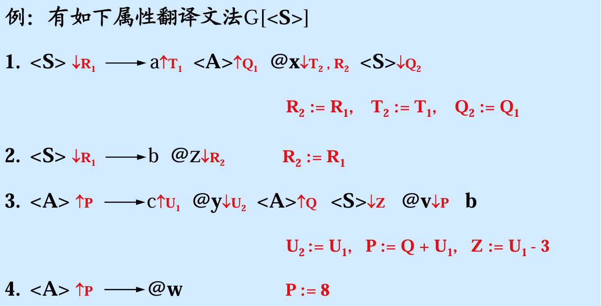
S的继承属性R1来自于初始设定值
继承属性传值进去
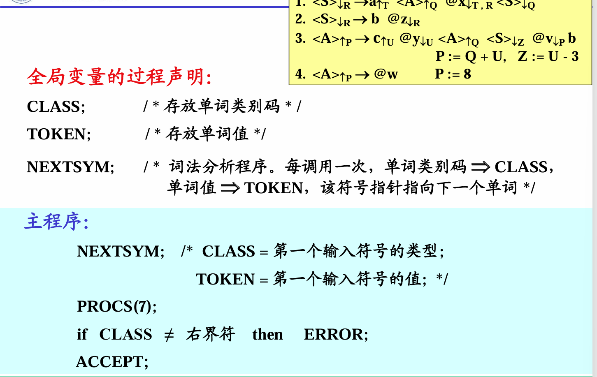
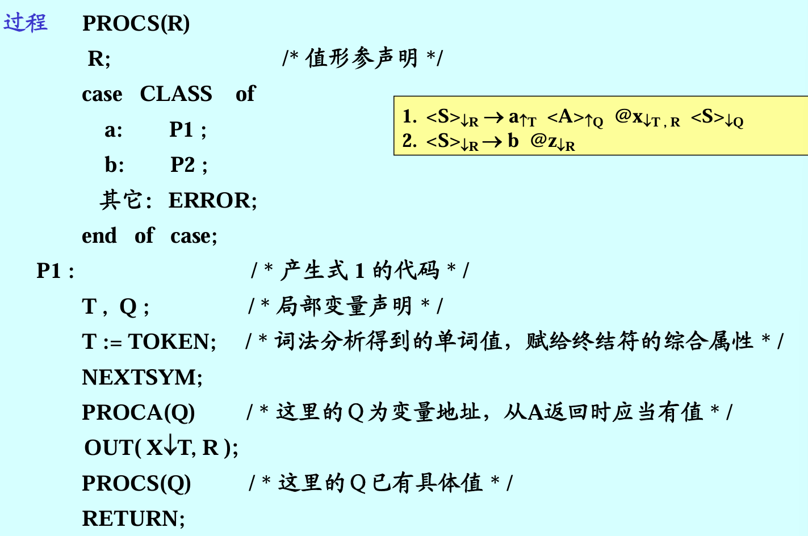
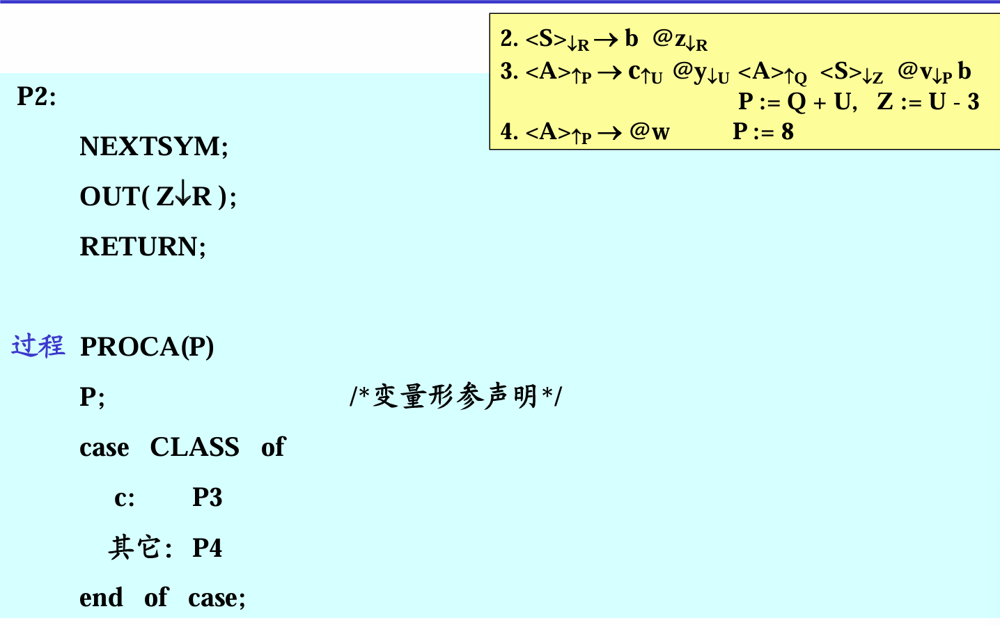
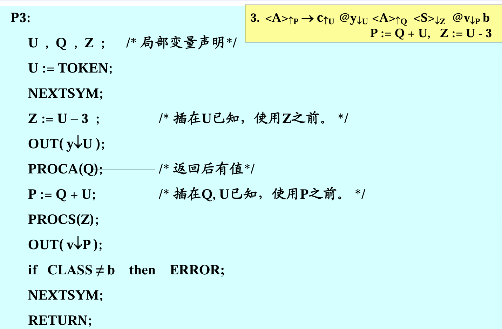
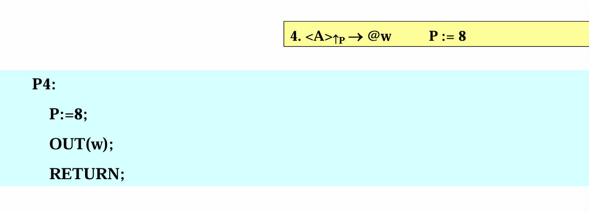

继承属性是从上往下继承，所以传的是“值”，而综合属性是从下往上传，所以传的是“地址”

例：构造将算术表达式翻译成四元组的属性翻译文法，并写出递归下降分析程序。由该属性翻译文法来描述翻译过程。

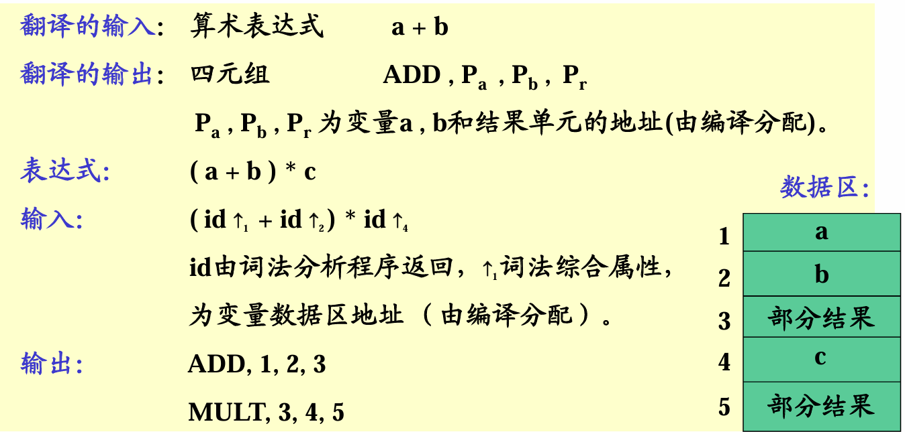
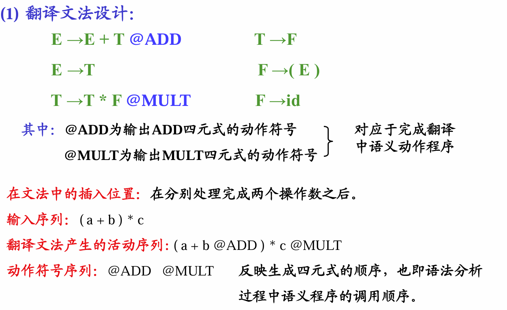

(2) 属性翻译文法的设计
在翻译文法的基础上可设计其属性翻译文法，以便语义分析过程中生成完整的四元式，完成翻译。
? 输入符号（操作数）有一综合属性，它是该符号在数据区的地址。
? 每个非终结符有一个综合属性，该属性是由它产生的代表该子表达式在数据区中的地址（中间结果）。
? 动作符号有三个继承属性，它们分别是左右操作数和运算结果在数据区的地址。

这样可得表达式的属性翻译文法――可将中缀表达式翻译成四元式

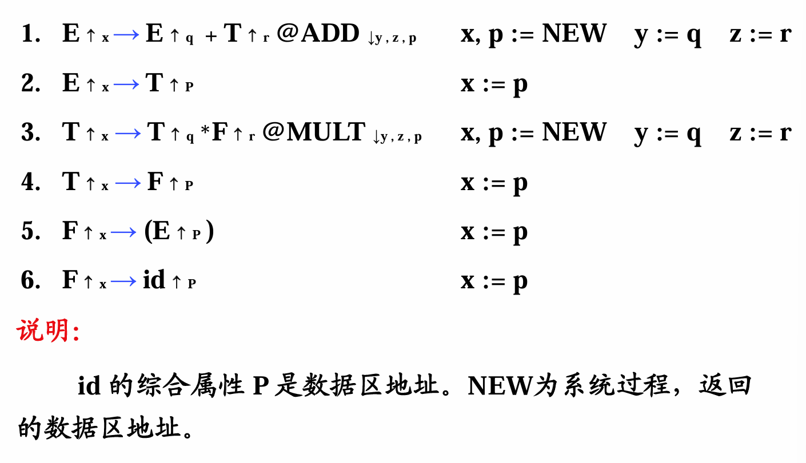
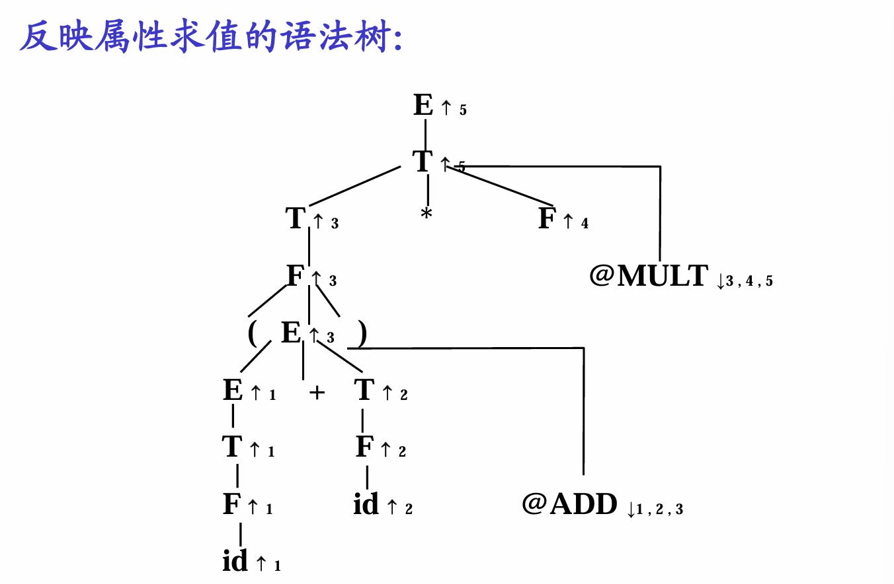
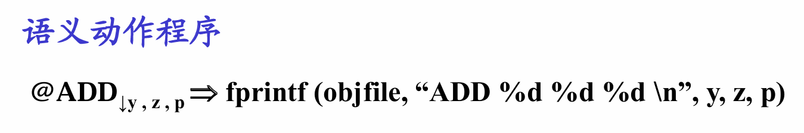
