# 文法和语言的概念和表示

## 1、预备知识

### 1、字母表和符号串
字母表：符号的非空有限集
符号：字母表中的元素
符号串：符号有穷序列
空符号串：无任何符号的符号串，用ε表示；注意ε也是一个元素

符号串形式定义：
有字母表Σ，定义：
（1）ε是Σ上的符号串；
（2）若x是Σ上的符号串，且a属于Σ，则ax或xa是Σ上的符号串；
（3）y是Σ上的符号串，iff（当且仅当）y可由（1）和（2）产生。（递归定义）

### 2、符号串和符号串集合的运算

1. 相等：若x、y是集合上的两个符号串，则x＝y iff（当且仅当）组成x的每一个符号和组成y的每一个符号依次相等
2. 符号串的长度：x为符号串，其长度|x|等于组成该符号串的符号个数。
3. 符号串的联接：若x、y是定义在Σ上的符号串，且x＝XY，y＝YX，则x 和y 的联接xy＝XYYX也是Σ上的符号串。注意：一般xy≠yx，而εx＝xε
4. 符号串集合的乘积运算：令A、B为符号串集合，定义
**AB＝{ xy |x∈A, y∈B}**
例：A＝{a,b},  B={c,d},     AB=  ？
{ac，ad，bc，bd}
因为εx＝xε＝x，所以{ε}A = A{ε} = A；{ε}不是空集
5. 幂运算：有符号串集合A，定义
A0={ε}, A^1=A, A^2=AA, A^3=AAA, ……
 …… A^n＝A^n-1A=A^An-1  ，n>0
6. 符号串集合的闭包运算：设A是符号串集合，定义
A＋＝A^1∪A^2∪A^3∪……∪A^n∪……
称为集合A的正闭包。(无穷)
A*＝A^0∪A＋
称为集合A的闭包（克林闭包）。
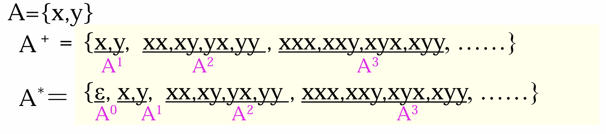

注：单词集是 基本字符集克林闭包 的子集
句子是 单词集克林闭包 的子集
语言的句子是定义在单词集上的符号串
上述允许“空”的出现
**程序是 句子集的克林闭包 的子集**

## 2、文法的非形式讨论

1. 文法：文法是对语言结构的定义与描述。即从形式上用于描述和规定语言结构的称为“文法”（或称为“语法”）。
如何定义句子的合法性？
?有穷语言
?无穷语言：人们平时说的话说无穷语言
2. 语法规则：我们通过建立一组规则，来描述句子的语法结构。
规定用“::=”表示“由……组成”。（左边由右边组成）

例如：
<句子>::=<主语><谓语>
<主语>::=<代词>|<名词>（注意，这里有个“或”的标志，所以这个算两条规则）
<代词> ::=你|我|他
<名词>::=王民|大学生|工人|英语
<谓语>::=<动词><直接宾语>
<动词>::=是|学习
<直接宾语>::=<代词>|<名词>
总共15条规则

3. **由规则推导句子**：
有了一组规则之后，可以按照一定的方式用它们去推导或产生句子。
推导方法：从一个要识别的符号开始推导，即用相应规则的右部来替代规则的左部，每次仅用一条规则去进行推导。

例如：
<句子>  => <主语><谓语>
 <主语><谓语> => <代词><谓语> 
…… ……
这种推导一直进行下去，直到所有带< >的符号都由终结符号替代为止。（没有符号“< >”）
判断句子是否合法，看能否按照规则推导出。如果不能就不是句子。

按照上述规则，只有98个句子，是有穷语言。

上述推导可写成<句子> =>the big elephant ate the peanut

所谓文法是在形式上对句子结构的定义与描述，而未涉及语义问题。

4. **语法树**：
我们用语法树来描述一个句子的语法结构。
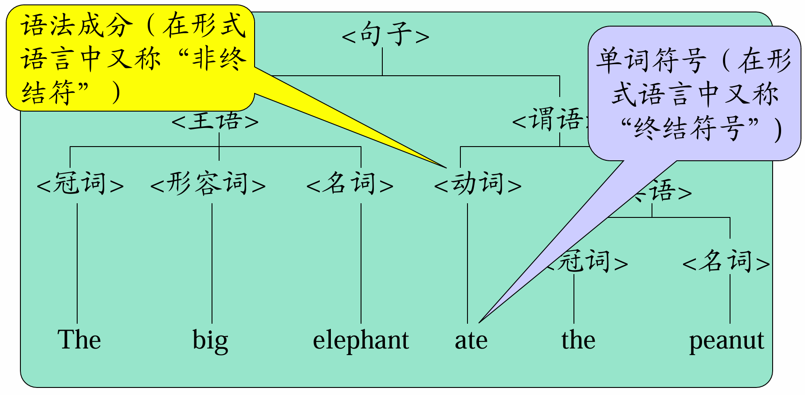

## 3、文法和语言的形式化定义

### 1、文法的定义

定义1. 文法G =（Vn，Vt，P，Z）（四元式）G代表gramer， 
Vn：非终结符号集
Vt：终结符号集 t代表终端terminal
V＝Vn ∪Vt 称为文法的字汇表 vocabulary
P：产生式或规则的集合
规则：U ::=x U ∈Vn,   x∈V*
Z：开始符号（识别符号） Z∈Vn （如果是Vt则不用推导了，所以开始符号一定属于Vn）

文法没有递归定义，则一定是有穷语言；若想生成无穷语言，必须有递归定义。
问题：如何写规则，可以让生成的句子是无穷的并且不以0打头。

**事实上，四元式不用全部写出，只需要写P和Z即可
并且，在规则P里面，所有左侧的都是带有“<>”的符号，属于Vn；右侧除去左侧的符号，属于Vt，不带“<>”。**

产生式左边符号构成集合Vn，且Z ∈Vn
有些产生式具有相同的左部，可以合在一起。
例、<无符号整数> →<数字串> 
<数字串> → <数字串> <数字> | <数字> 
<数字> →0| 1 | 2 | 3 | …… | 9
（文法的BNF范式表示）

给定一个文法，实际只需给出产生式集合，并指定识别符号。
（识别符号一般约定为第一条规则的左部符号）
例、G[<无符号整数>]
 <无符号整数> →<数字串> 
<数字串> → <数字串> <数字> | <数字> 
<数字> →0| 1 | 2 | 3 | …… | 9

### 2、推导的形式定义

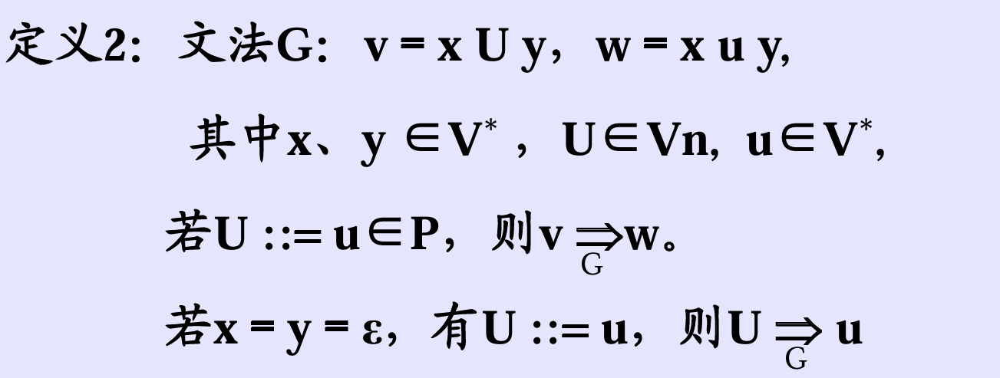
最左推导x=ε，最右推导y=ε
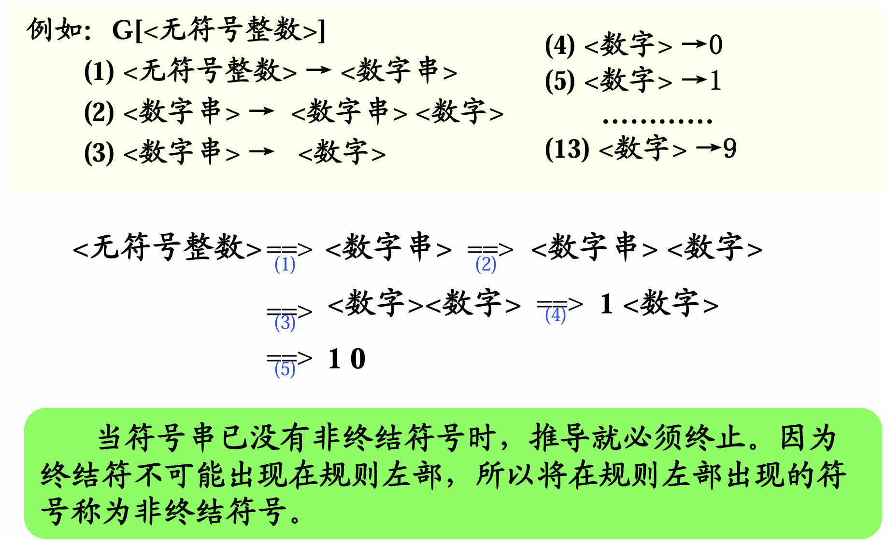
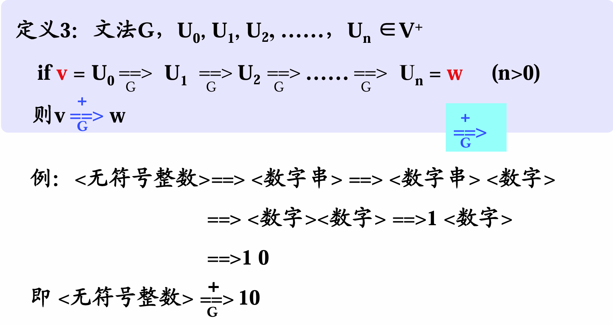
多步推导

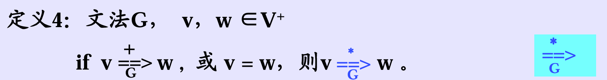
这个是多步推导+0步推导

规范推导：最右推导,因为y属于终结符号集
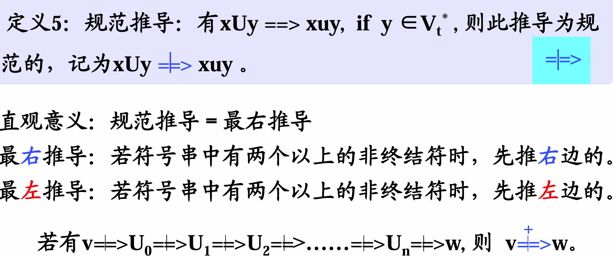

也就是说，句子是由终结符组成的字符串；若包含非终结符，则是句型。句子也属于句型。
给语法可以推句子，但是给句子无法推出语法

等价文法定义：
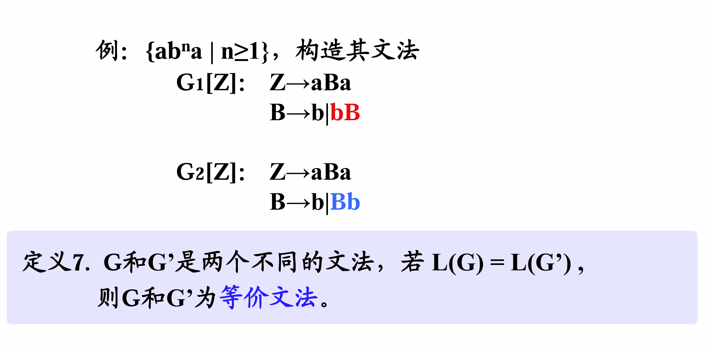

编译感兴趣的问题：给定x, G, 求x 是否属于 L(G) 

#### 4、递归文法

1. 递归规则：规则右部有与左部相同的符号
对于U::= xUy
若x=ε,即U::=  Uy，左递归；
若y=ε,即U::=  xU，右递归。
2. 递归文法：文法G，存在U∈Vn
 if   U=+=>…U…, 则G为递归文法(自嵌入递归)；
if   U=+=>U…, 则G为左递归文法；
if   U=+=>…U, 则G为右递归文法。
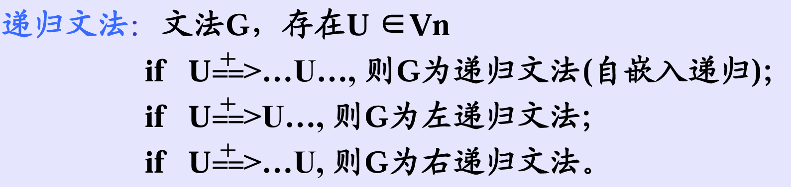

**左递归文法的缺点：不能用自顶向下的方法来进行语法分析**

**递归文法的优点：可用有穷条规则，定义无穷语言**

#### 5、句型的短语，简单短语，句柄

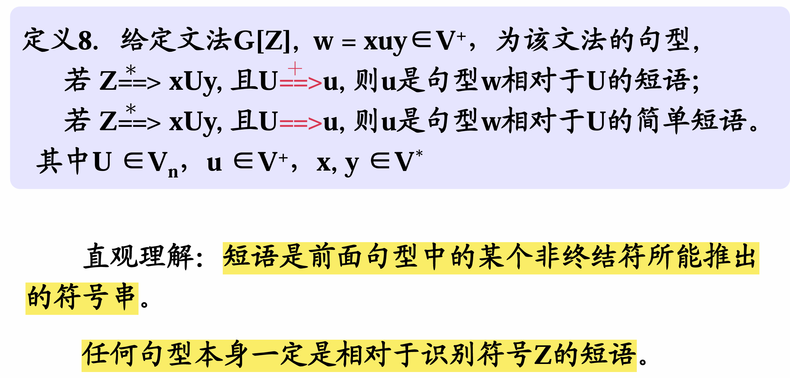

例如，主语推出冠词，形容词，名词，那么冠词，形容词，名词分别是句型相对于主语的短语。**推一步的是简单短语，推多步是短语**。又如：big和名词是相对于主语的短语，big是相对于形容词的简单短语
**注：不能说“big是相对于主语的短语”，要说全**；具体而言，语法树的一层是短语，缺少一个就不能说是短语
简单短语一定能够规约

识别符号Z是从一开始就推，所以后面所有内容都是Z的短语。

**定义9.  任一句型的最左简单短语称为该句型的句柄。**
给定句型找句柄的步骤：
短语->简单短语->句柄
句柄只有一个。

### 4、语法树与二义性文法
#### 1、语法树

（1）语法树：句子结构的图示表示法，它是一种有向图，由结点和有向边组成。
方向：向下

结点：符号
根结点：识别符号
中间结点：非终结符
叶结点：终结符或非终结符

叶子节点从左到右的排列，就是句子
有向边：表示结点间的派生关系。

( 2 )  句型的推导及语法树的生成（自顶向下）
给定G[Z]，句型w：
可建立推导序列，Z=*=>w
可建立语法树，以Z为树根结点，每步推导生成语法树
的一枝，最终可生成句型的语法树。
**注意一个重要事实**：文法所能产生的句子，可以用不同的推导原则（使用产生式顺序不同）将其推导出来。语法树的生成规律不同，但最终生成的语法树形状完全相同。某些文法有此性质，而某些文法不具有此性质。**（二义文法）**
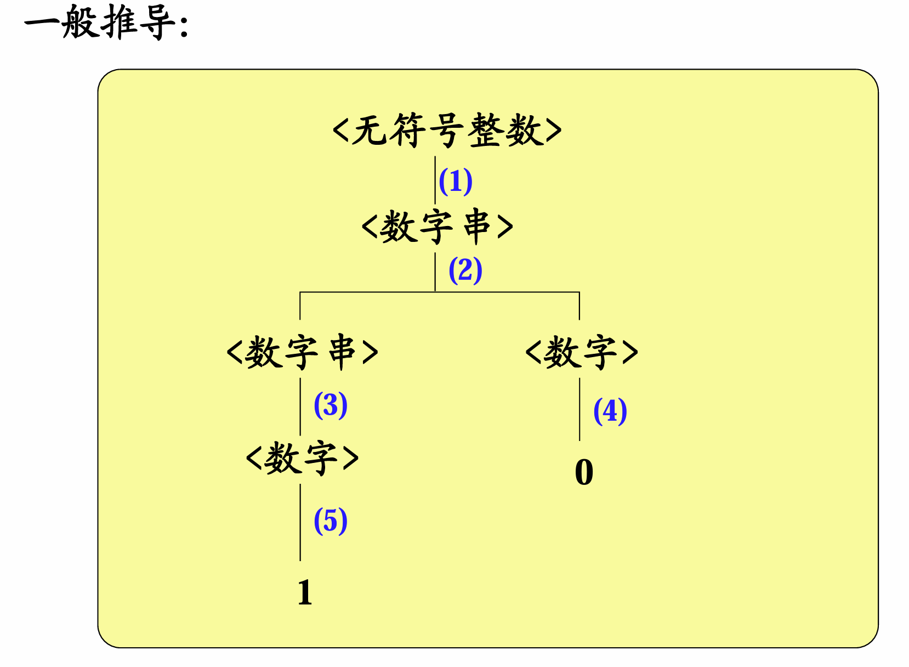
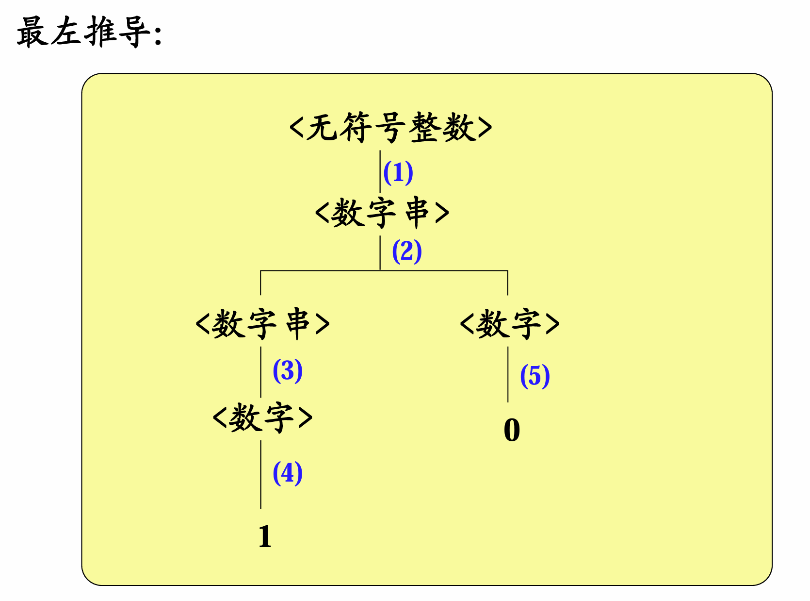
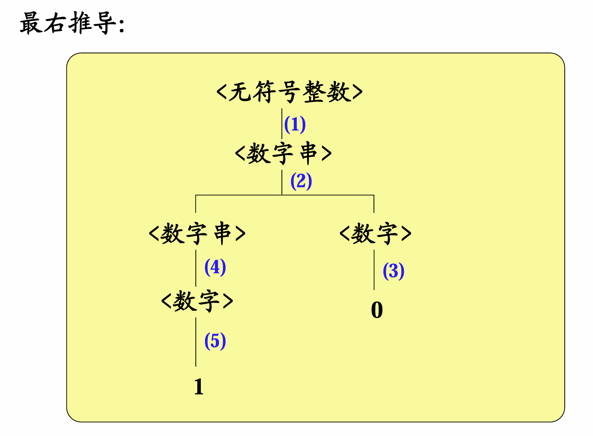
无二义性

子树的叶子节点，从左到右排列是短语；只有一层是简单短语
句子和句型相对于整棵树而言；短语和简单短语相对于子树
子树：语法树中的某个结点（子树的根）连同它向下派生的部分所组成。
定理：
某子树的末端结点按自左向右顺序为句型中的符号串，则该符号串为该句型的相对于该子树根的短语。
只需画出句型的语法树，然后根据子树找短语→简单短语→句柄。

( 4 )  树与推导
句型推导过程<==>句型语法树的生长过程
**由推导构造语法树**：
从识别符号开始，自右向左建立推导序列。
由根结点开始，自上而下建立语法树。

**由语法树构造推导**
自下而上地修剪子树的末端结点，直至把整棵树剪掉（留根），每剪一次对应一次规约。（每次剪一枝）
从句型开始，自左向右地逐步进行规约，建立推导序列。

**定义12.  对句型中最左简单短语（句柄）进行的规约称为规范规约。**
每一次只能往上剪一层。最左规约；获得的推导倒着写就是最右推导

**定义13.通过规范推导或规范规约所得到的句型称为规范句型。**
根据规范推导和规范规约得到句型，然后判断题目的句型是不是规范的。

#### 2、文法的二义性

定义14.1 若对于一个文法的某一句子存在两棵不同的语法树，则该文法是二义性文法，否则是无二义性文法。换而言之，无二义性文法的句子只有一棵语法树，尽管推导过程可以不同。
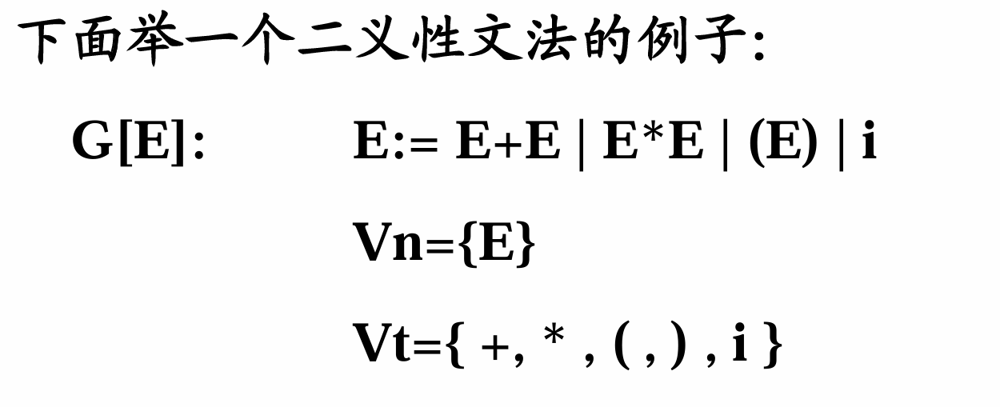
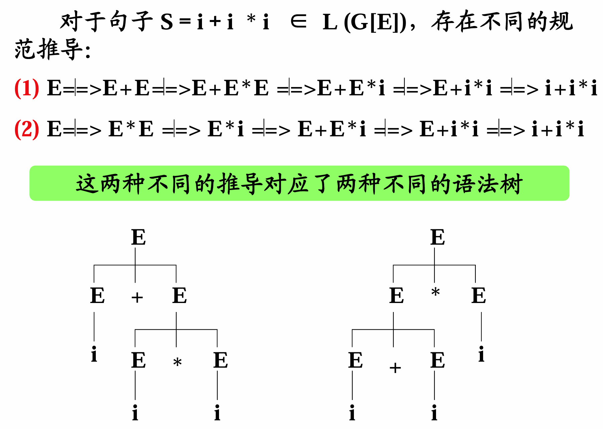

一个句子，两个规范推导，或者两个不同的语法树，就是二义性;
从下往上，某规范句型的句柄不唯一，也是二义文法。

若文法是二义性的，则在编译时就会产生不确定性。
**文法的二义性是不可判定的，即不可能构造出一个算法，通过有限步骤来判定任一文法是否有二义性。**

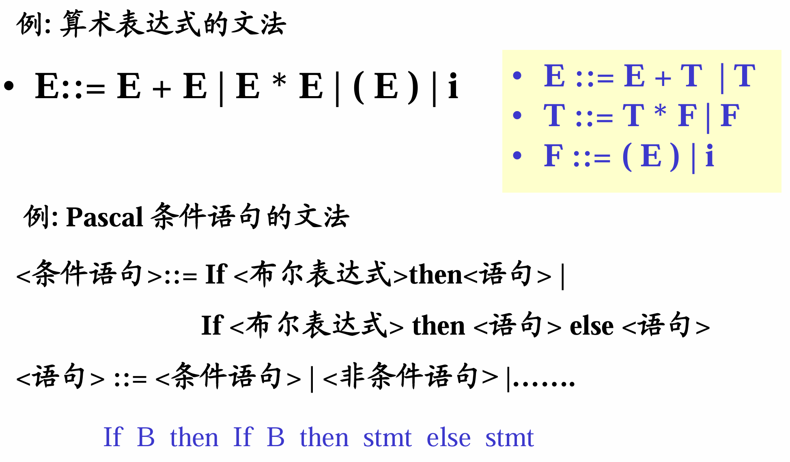

else与最近的if配对，否则存在二义性

### 5、有关文法的实用限制

若文法中有如U::=U的规则，则这就是有害规则，它会引起二义性。
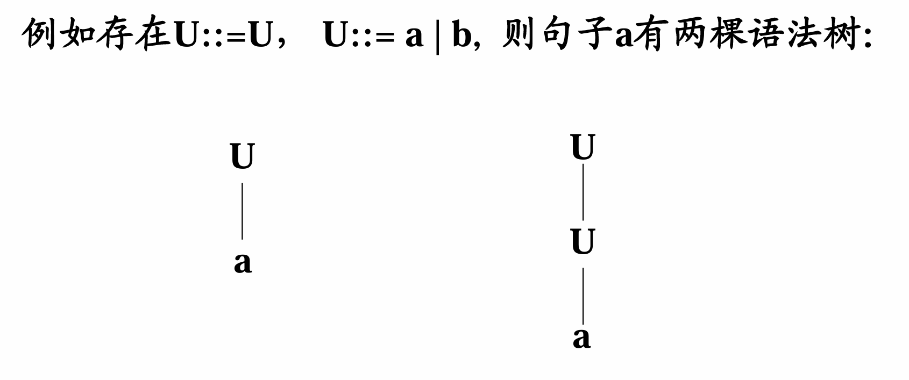
这个是**有害文法**

**多余规则：**
（1）在推导文法的所有句子中，始终用不到的规则。即该规则的左部非终结符不出现在任何句型中。
（2）在推导句子的过程中，一旦使用了该规则，将推不出任何终结符号串。即该规则中含有推不出任何终结符号串的非终结符。

例如给定G [ Z ]，若其中关于U的规则只有如下一条：
U::= x U y
该规则是多余规则。
若还有U::= a，则此规则并非多余

**若某文法中无有害规则或多余规则，则称该文法是压缩过的。**

对于文法的压缩过程，如果找到一个死循环的多余规则，则要把它删去，并且所有规则右侧，出现该多余规则左侧符号的，都要删去。
不用的规则直接删除即可
有害规则也要删去。

### 7、其它表示法：

严格来说，开始符号Z不是集合，否则树成了多个根

1、扩充的BNF表示(Backus Normal Form)
 ? BNF的元符号：<,  >,  ::=,  |
 ?扩充的BNF的元符号：<,  >,  ::=,  |,  {,  },  [,  ],  (,  )

 中括号内的内容，最少重复0次，最多重复1次
 大括号表示重复0-无穷次
 小括号表示组合，不是运算符。
 例如 (a|b)a，表示能推出aa或ba
 元符号不是Vt

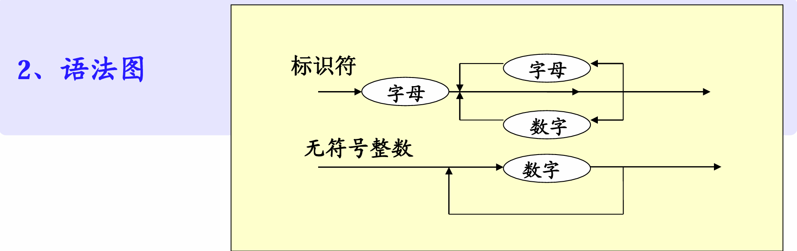
实际上是个自动机

### 8、文法和语言分类

形式语言：用文法和自动机所描述的没有语义的语言。
语言定义： L(G[Z]) = { x | x∈Vt*, Z =+=> x }
文法定义：乔姆斯基将所有文法都定义为一个四元组：
G=（Vn，Vt，P，Z）
Vn：非终结符号集
Vt：终结符号集
P：产生式或规则的集合
Z：开始符号（识别符号） Z∈Vn

文法和语言分类：0型、1型、2型、3型
这几类文法的差别在于对产生式施加不同的限制。

0型： P：u::=v
其中u∈V＋，v∈V*
 0型文法称为短语结构文法。规则的左部和右部都可以是符号串，一个短语可以产生另一个短语。
 例如：翻译
0型语言：L0     这种语言可以用图灵机(Turing)接受。

1型： P：xUy::= xuy
其中U∈Vn，
x、y、u∈V*

称为上下文敏感或上下文有关。也即**只有在x、y这样的上下文中**才能把U改写为u。
不能随便替换U变成u，必须在上文x和下文y的限制下才能替换。

这类文法的任何产生式α::=β 均满足|α| ≤ |β|（其中|α|和|β|分别为α和β的长度）；仅仅S ::=?例外，但S不得出现在任何产生式的右部。也就是说，一般不允许把u替换成空串?。
1型语言：L1 这种语言可以由一种线性界限自动机接受。

2型： P：U::= u
其中U∈Vn，
u∈V*
即x和y是?
称为上下文无关文法。也即把U 改写为u 时，不必考虑上下文。
注意：2型文法与BNF表示相等价。
2型语言：L2     这种语言可以由下推自动机接受。

3型文法：
（左线性）
P：U::=T
或 U::=wT
其中U、w∈Vn
 T∈Vt
（右线性）
P：U::=T
或 U::=Tw
其中U、w∈Vn
 T∈Vt

3型文法称为正则文法。它是对2型文法进行进一步限制。
3型语言：L3又称正则语言、正则集合这种语言可以由有穷自动机接受。
正则表达式属于正则语言

根据上述讨论，L0 包含L1 包含 L2 包含 L3
 0型文法可以产生L0、L1、L2、L3，但2 型文法只能
产生L2，不能产生L1。