# 符号表管理

保留字，常数，分界符，标识符
常数和标识符应当进入符号表，另外两个是固定的，不需要保存。

## 1、概述
符号表：编译程序用来记录源程序中各种名字的特征信息，也称为名字特性表。
特性信息：种类，类型，维度，参数个数，目标地址等.
名字: 程序名、过程名、函数名、用户定义类型名、变量名、常量名、枚举值名、标号名等。

建表和查表的必要性(符号表在编译过程中的作用):
存储单元地址也必须登录在符号表中

有关符号表的操作：填表和查表
填表：当分析到程序中的说明或定义语句时，应将说明或定义的名字，以及与之有关的信息填入符号表中。
例：Procedure  P( )
查表：(1)  填表前查表，检查在程序的同一作用域内名字是否重复定义；
(2)  检查名字的种类是否与说明一致；
(3)  对于强类型语言，要检查表达式中各变量的类型
是否一致；
(4)  生成目标指令时，要取得所需要的地址。

## 2、符号表的组织与内容

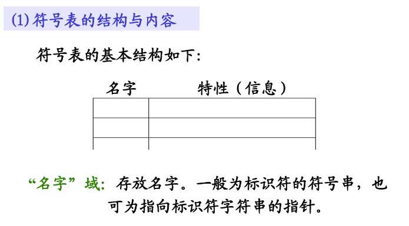
“名字”域：存放名字。一般为标识符的符号串，也可为指向标识符字符串的指针。
“特性”域：可包括多个子域，分别表示标识符的有关

**符号表组织方式**：
1.**统一符号表**――不论什么名字都填入统一格式的符号表中
符号表表项应按信息量最大的名字设计。填表、查表比较方便，结构简单，但是浪费大量空间。
2.**对于不同种类的名字分别建立各种符号表**
节省空间，但是填表和查表不方便。
①符号名表（用来登记源程序中的常量名、变量名、数组名和过程名
等，并记录其属性、引用等）
②常数表（分类型登记各种常量值）
③标号表（登记标号的定义与应用）
④分程序入口表（登记过程的层号、分程序符号表的入口等）
⑤中间代码表

3.折中办法――大部分共同信息组成统一格式的符号表。特殊信息另设附表，两者用指针连接。
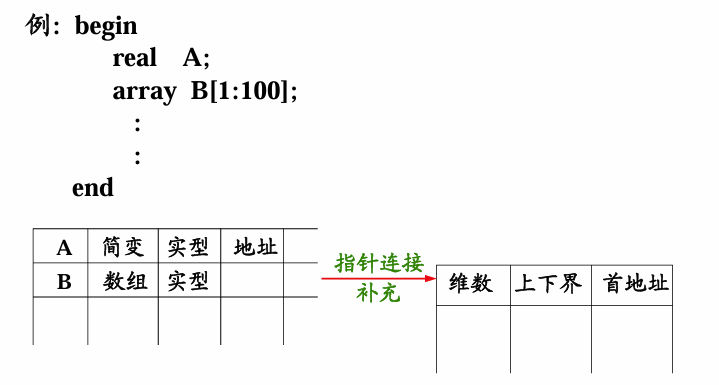
冒号前后表示数组上界和下界，B是一维数组.

## 3、非分程序结构语言的符号表组织
(1)非分程序的结构语言：每个可独立进行编译的程序单元是一个不包含有子模块的单一模块。
如FORTRAN语言。即函数内不能再嵌套函数。
C语言以前也属于非分程序，但是近几年版本也可以嵌套函数

变量只有全局变量和局部变量，局部变量出模块后不再生效。

(2)标识符的作用域及基本处理办法

1. 作用域
全局：子程序名、函数名和公共区名。
局部：程序单元中定义的变量。
2. 符号表的组织:   全局符号表，局部符号表
3. 
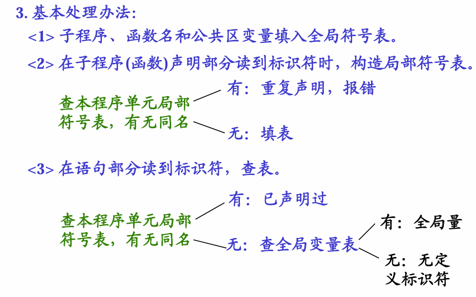
4. 程序单元结束：释放该程序单元的局部符号表。
5. 程序执行完成：释放全部符号表。

(3)符号表的组织方式
1. 无序符号表――按扫描顺序建表，查表要逐项查找。查表操作的平均长度为（n + 1）／2。**理解：有n个符号，还有一种情况是查不到，所以是(n+1)的平均**
2. 有序符号表：符号表按变量名进行字典式排序。
线性查表:  （n + 1）/2
折半查表: Log2(n)
排序也需要时间
3. 散列符号表（Hash表）：
符号表地址= Hash（标识符），需要解决冲突

## 4、分程序结构语言的符号表组织
(1) 分程序的结构语言：模块内可嵌入子模块。
(2) 标识符的作用域和基本处理方法
作用域：标识符局部于所定义的模块（最小模块）
① 模块中所定义标识符的作用域是定义该标识符的子程序。
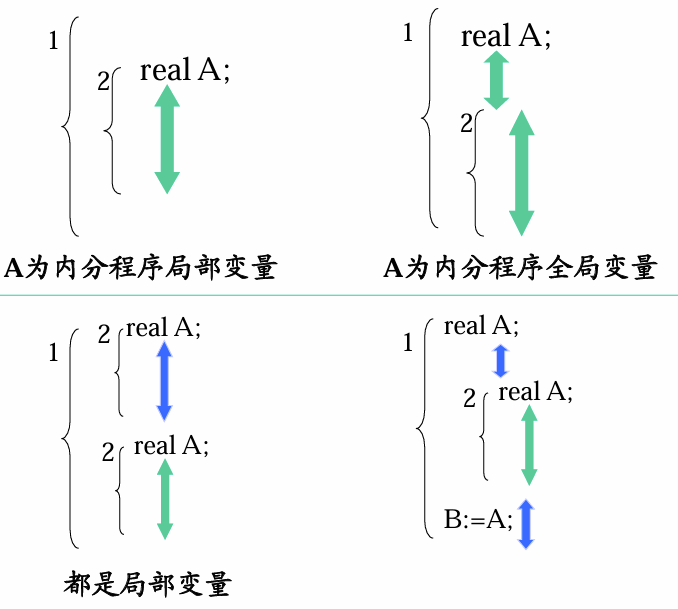
②过程或函数说明中定义的标识符（包括形参）
其作用域为本过程体。
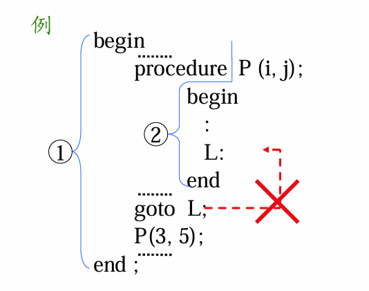
现在很多高级语言会将L直接作为全局，这样goto可以达到

③循环语句中定义的标识符，其作用域为该循环语句。
**不能从循环体外转到循环体内。循环语句应看作一层**！
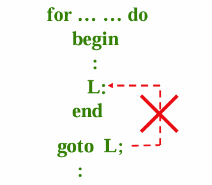

基本处理办法：
建查符号表均要遵循标识符作用域规定进行。
建表：不能重复，不能遗漏。
查表：按标识符作用域查找。
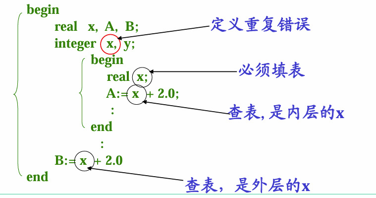
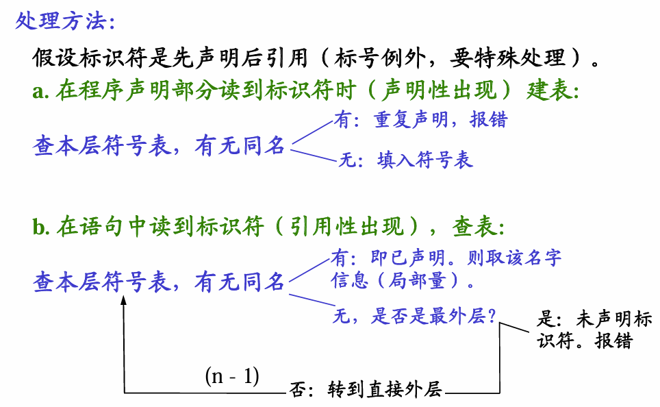
 c. 标准标识符的处理
主要是语言定义的一些标准过程和函数的名字。它们
是标识符的子集。如sin  con  abs….（注意它们不是语言的保留字）
特点：
1) 用户不必声明就可全程使用。
2) 设计编译程序时，标准名字及其数目已知。处理方法：
1) 单独建表：使用不便，费时。
2) 预先将标准标识符填入名字表中。因为它们是全程量，所以应填入最外层。

分程序符号表的组织方式：
1、分层组织符号表的登记项
各分程序符号表登记项按照语法识别顺序连续排列在一起，不为其内层分程序的符号表登记项所割裂。
２、用“分程序表”索引各分程序符号表的信息
分程序表中的各登记项是自左至右扫描源程序的过
程中，按分程序出现的顺序依次填入的，且对每一个分程序填写一个登记项。
分程序表登记项序号隐含地表征各分程序的编号。

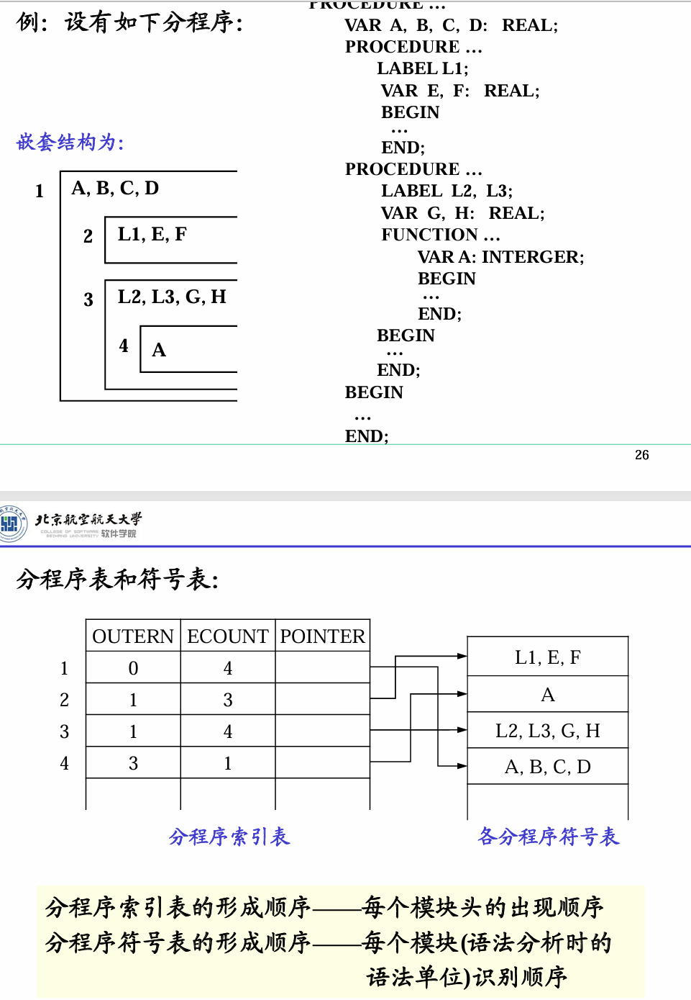
分程序索引表的形成顺序――每个模块头的出现顺序
分程序符号表的形成顺序――每个模块(语法分析时的语法单位)识别顺序

**分程序符号表构造方法：**
本例中，分程序符号表的形成顺序为2、4、3、1，这个次序是闭分程序的次序(分程序中END出现的次序)。(分程序闭合后才能结束)

为使各分程序的符号表连续地邻接在一起，并在扫描具有嵌套分程序结构的源程序时，总是按先进后出的顺序来扫描其中各个分程序，可设一个临时工作栈。

每当进入一层分程序时，就在栈顶预造该分程序的符号表，而当遇到该层分程序的结束符(END)时该分程序的全部登记项已位于栈顶，再将该分程序的全部登记项移至正式符号表中。

**设立栈**

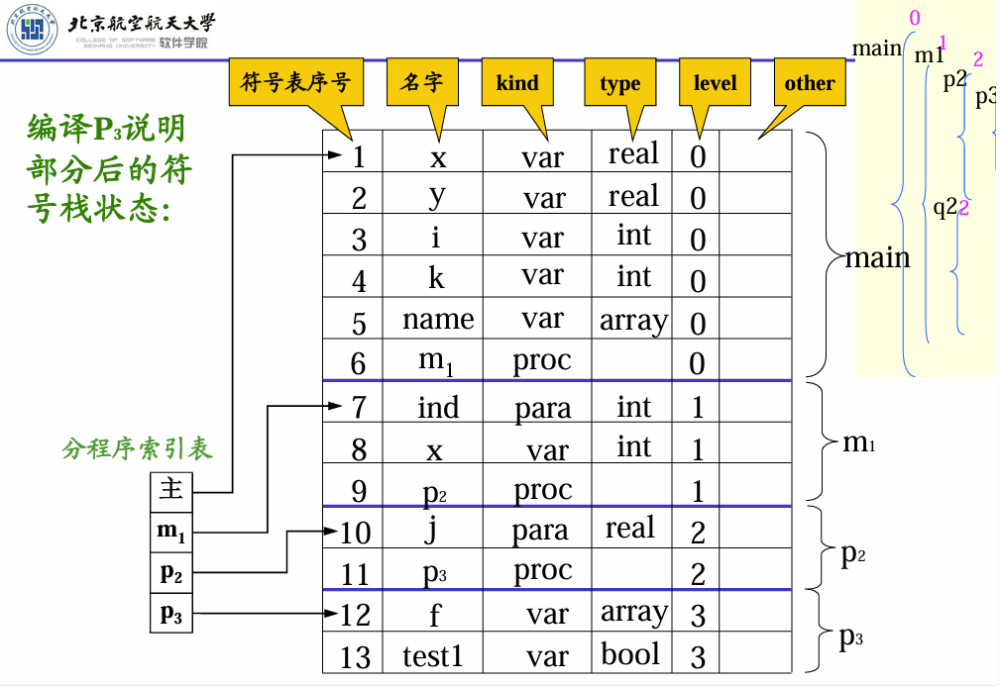
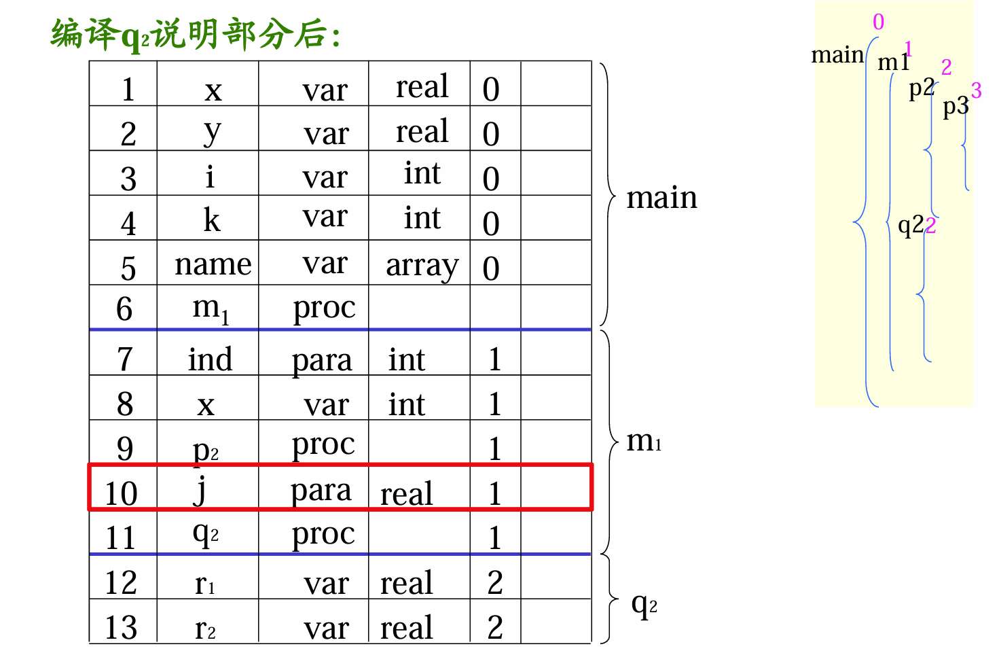

当过程和函数体编译完成后，应将与之相应的参数名和局部变量名以及后者的特性信息从符号表中删去。