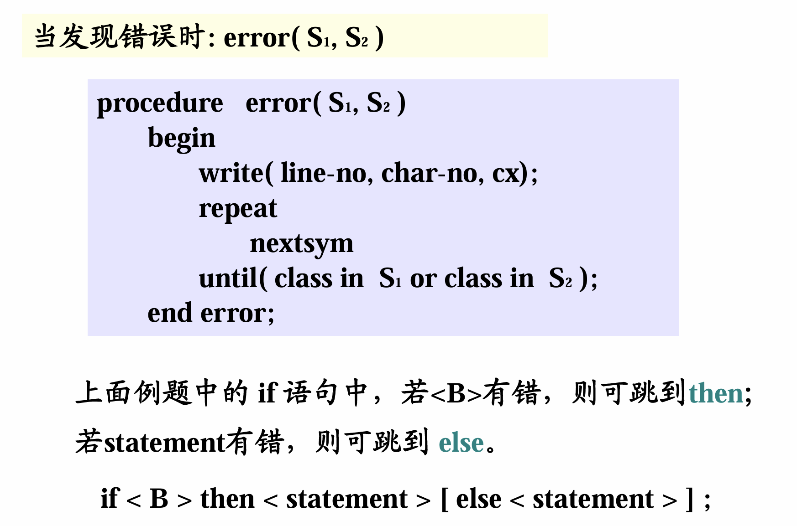

# 错误处理
## 1、概述

1. 错误处理是编译器的必备功能之一

**错误包括：语法错误，语义错误。**
语法错误：程序结构不符合语法（包括词法）规则的错误。
语义错误：程序不符合语义规则或超越具体计算机系统的限制。
**超越系统限制：（计算机系统和编译系统）**
1. 数据溢出错误，常数太大，计算结果溢出。
2. 符号表、静态存储分配数据区溢出。
3. 动态存储分配数据区溢出。

正确的源程序：通过编译，生成目标代码。
错误的源程序：通过编译，发现并指出错误。

编译程序对于语法和语义正确的源程序要正确地编译生成等价的目标代码；而对于错误的源程序不能一发现就停止，而是要能检查出错误的性质和出错位置，并使编译能继续下去，同时尽可能多而准确地发现错误和指出各种错误。

2. 编译器的错误处理能力
(1) 诊察错误的能力。
(2) 报错及时准确（出错位置，错误性质）。
(3) 一次编译找出错误的多少。
(4) 改正错误的能力。
(5) 遏制重复错误信息的能力。

### 1.3、错误的诊察和报告
**错误报告**：
1. **出错位置**：即源程序中出现错误的位置。
实现：设立行号计数器 line-no
设立单词序号计数器 char-no（如果以单词为序）
一旦诊察出错误，当前的计数器内容就是出错位置。
2. **出错性质**：
可直接显示文字信息
可给出错误编码
3. 报告错误：（两种方式）
(1) 分析以后再报告（显示或者打印）
编译程序可设一个保存错误信息的数据区(可用记录型数组)，将语法语义分析所诊断到的错误送数据区保存，待源程序分析完以后，统一显示或打印错误信息。
(2) 边分析边报告
在分析一行源程序时若发现有错，可以立即输出该行源程序，并在其下输出错误信息。
**有时报错不一定十分准确（位置和性质），需进一步分析。**

### 1.4、错误处理技术

发现错误后，在报告错误的同时还要对错误进行处理，以方便编译能继续进行下去。目前有两种处理办法：
1. 错误改正：指编译诊察出错误以后，根据文法进行错误改正
但不是总能做到，如：A := B �CC * D + E )，不知道多一个右括号还是少一个左括号；左括号加在哪里也不知道。
2. 错误局部化处理：指当编译程序发现错误后，尽可能将把错误的影响限制在一个局部的范围，避免错误扩散和影响程序其它部分的分析。

(1)  一般原则
当诊断到错误以后，就暂停对后面符号的分析，跳过错误所在的语法成分（一旦跳过就认为该语法成分是**正确的**）然后继续往下分析。
词法分析：发现不合法字符，显示错误，并跳过该标识符（单词）继续往下分析。
语法语义分析：跳过所在的语法成分（短语或语句），一般是跳到语句右界符，然后从新语句继续往下分析。
(2)  错误局部化处理的实现（递归下降分析法）
CX：全局变量，存放错误信息。
? 用递归下降分析时，如果发现错误，便将有关错误信息（字符串或者编号）送CX，然后转出错误处理程序；
? 出错程序先打印或显示出错位置以及出错信息，然后跳出一段源程序，直到跳到语句的右界符（如end、; ），或正在分析的语法成分的合法后继符号为止，然后再往下分析。
(3) 提高错误局部化程度的方法
设S1: 合法后继符号集（某语法成分的后继符号）
S2: 停止符号（跳读必须停止的符号集）
