# 运行时的存储组织和管理

## 1、概述

**符号表是编译过程中产生，编译结束后不再保留；而这里是针对程序运行时的组织和管理**
(1) 运行时的存储组织及管理
目标程序运行时所需要存储空间的组织与管理以及源程序中变量存储空间的分配。
(2) 静态存储分配和动态存储分配
**静态存储分配**
在编译阶段由编译程序实现对存储空间的管理,和为源程序中的变量分配存储的方法。
**条件**：
如果在编译时能够确定源程序中变量在运行时的数据空间大小，且运行时不改变，那么就可以采用静态存储分配方法。（数组）
**动态存储分配**（malloc）
在目标程序运行阶段由目标程序实现对存储空间的组织与管理，和为源程序中的变量分配存储的方法。
**特点**
? 在目标程序运行时进行分配。
? 编译时要生成进行动态分配的目标指令。

## 2、静态存储分配
(1) 分配策略
由于每个变量所需空间的大小在编译时已知，因此可以用简单的方法给变量分配目标地址。
- 开辟一数据区。（首地址在加载时确定）
- 按编译顺序给每个模块分配存储。
- 在模块内部按顺序给模块的变量分配存储，一般用相对地址，所占数据区的大小由变量类型确定。
- 目标地址填入变量的符号表中。
这种分配策略要求语言不允许指针或动态分配，不允许递归调用过程。典型的例子是Fortran77。
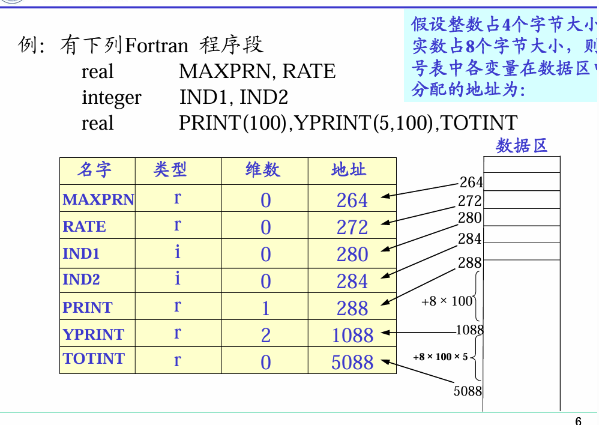

一般只能用于非分程序
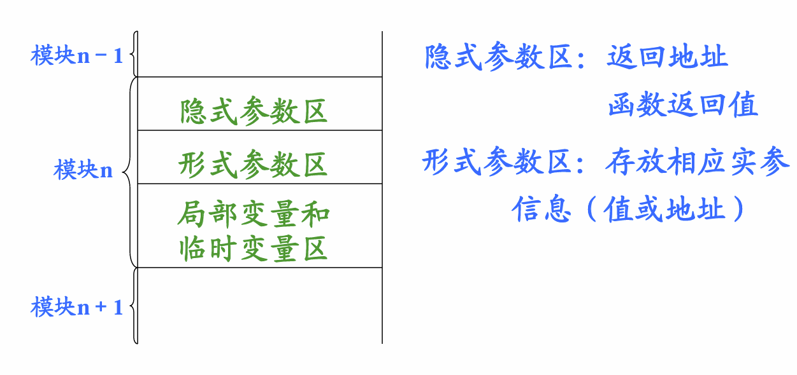

## 3、动态存储分配
实际上的分配要在目标程序运行时进行。

对于分程序结构，而且允许递归调用的语言，常使用栈式动态存储分配，即使用一个类似于堆栈的“运行栈”来实现数据区的分配。

分配策略是: 整个数据区为一个堆栈
(1) 当进入一个过程时，在栈顶为其分配一个数据区。
(2) 当退出一个过程时，撤消该过程的数据区。
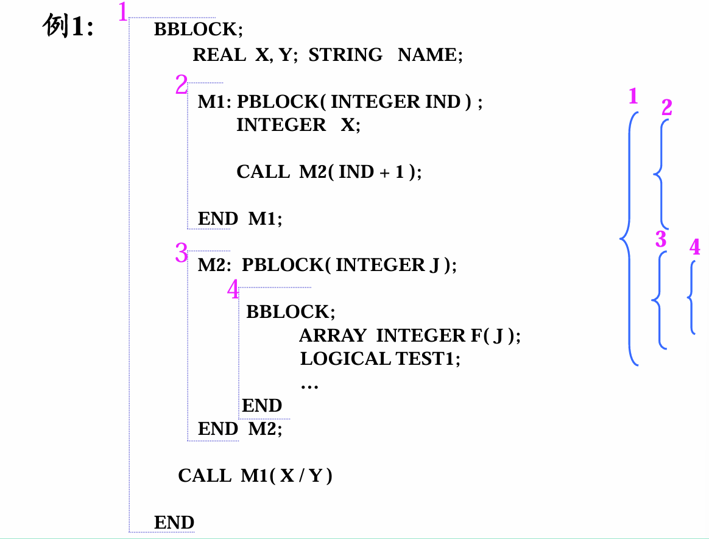
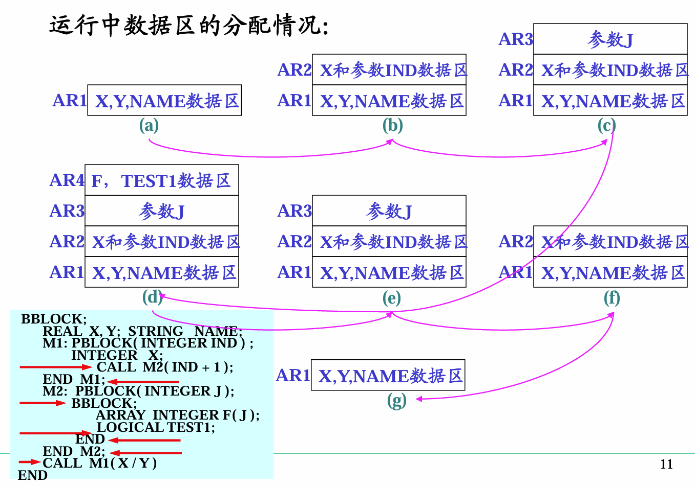
先运行CALL M1(X/Y)

### 3.1 活动记录

一个典型的活动记录可以分为三部分：
从上至下，包括：局部数据区，参数区，display区
(1) 局部数据区：
存放模块中定义的各个局部变量。
(2) 参数区：存放隐式参数和显式参数。
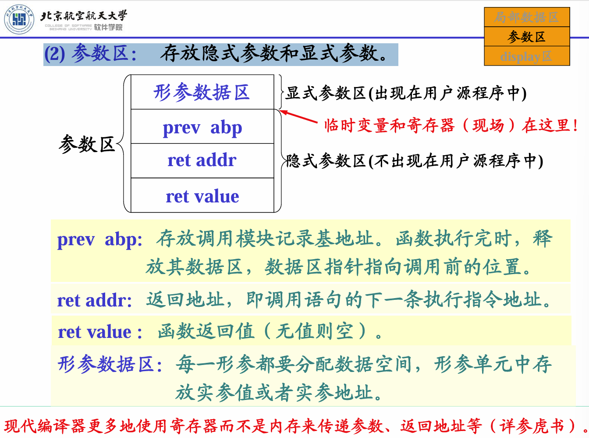
**寄存器这些在形参数据区**
caller调用者 callee被调用
caller的参数在prev abp
调用者的下一行地址在ret addr
ret value保存返回值，所以一般返回值只有一个

prev abp：存放调用模块记录基地址。函数执行完时，释放其数据区，数据区指针指向调用前的位置。
ret addr：返回地址，即调用语句的下一条执行指令地址。
ret value ：函数返回值（无值则空）。
形参数据区：每一形参都要分配数据空间，形参单元中存放实参值或者实参地址。

(3) display区：存放各外层模块活动记录的基地址。

知道自己外层地址是什么
模块4可以引用模块1和模块3中所定义的变量，故在模块4的display区，应包括AR1和AR3的基地址。

变量二元地址（BL、ON）
**BL：变量声明所在的层次**。可以用它找到该层数据区开始地址。
（注意为嵌套层次，并列过程具有相同层次）
**ON：相当于显示参数区开始位置的位移**（相对地址）。

主函数没有display区，因为外层就是操作系统。一般主函数没有参数，没有参数区。
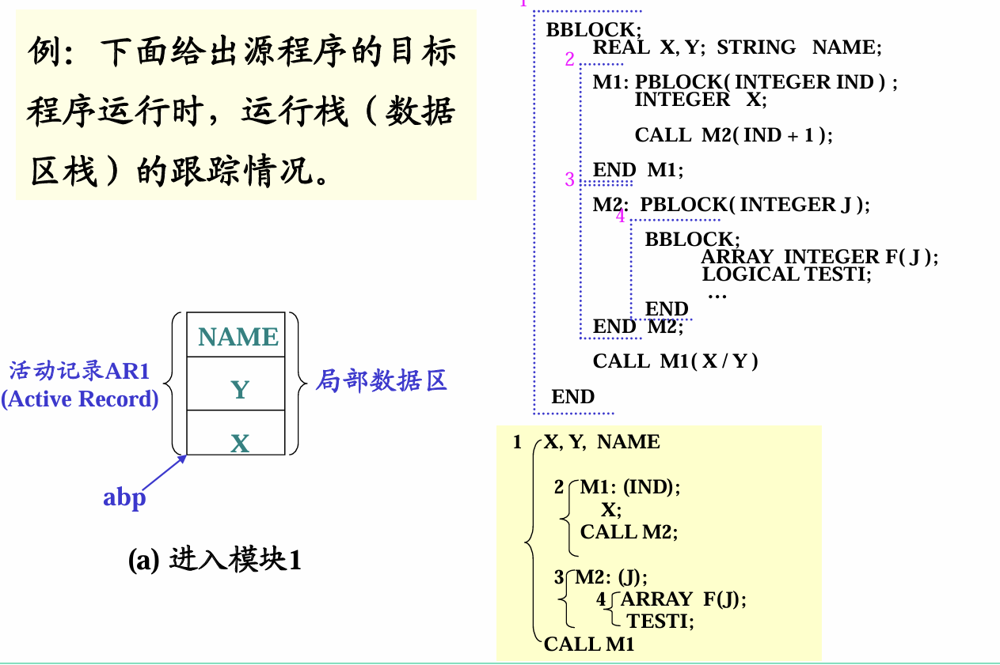
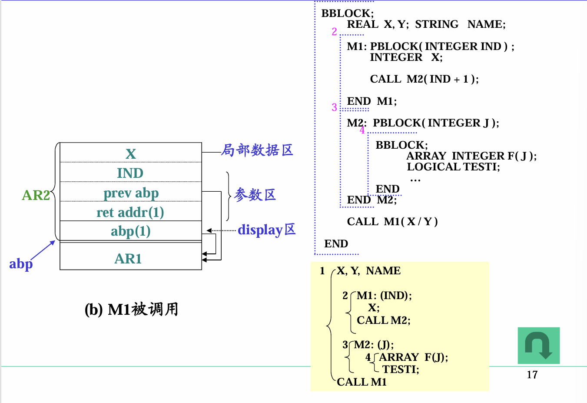
谁调用AR2，那么AR2的prev abp指向谁。
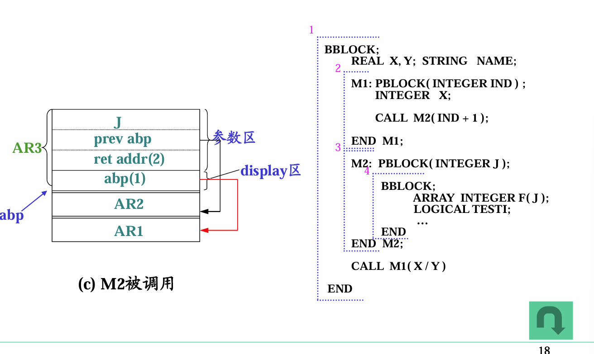
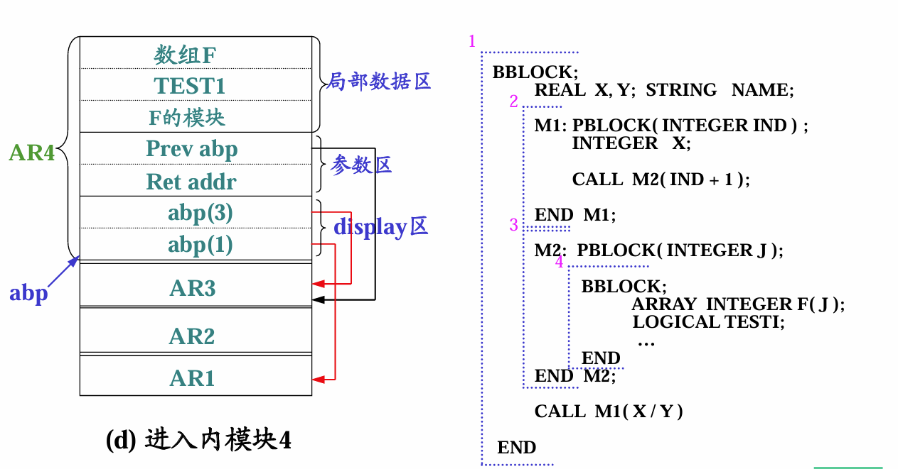

F的模块就是数组F的信息向量表。

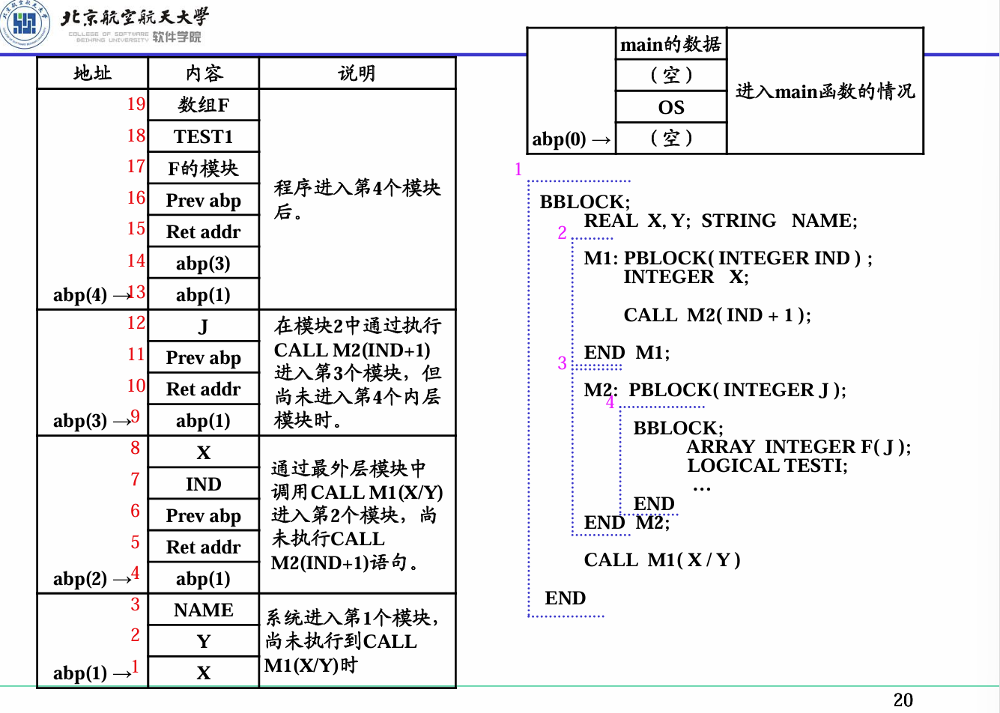
一定注意，**prev abp**是调用者的起始地址，而abp(i)是外层的起始地址。两者不同。

### 3.2 建造display区的规则

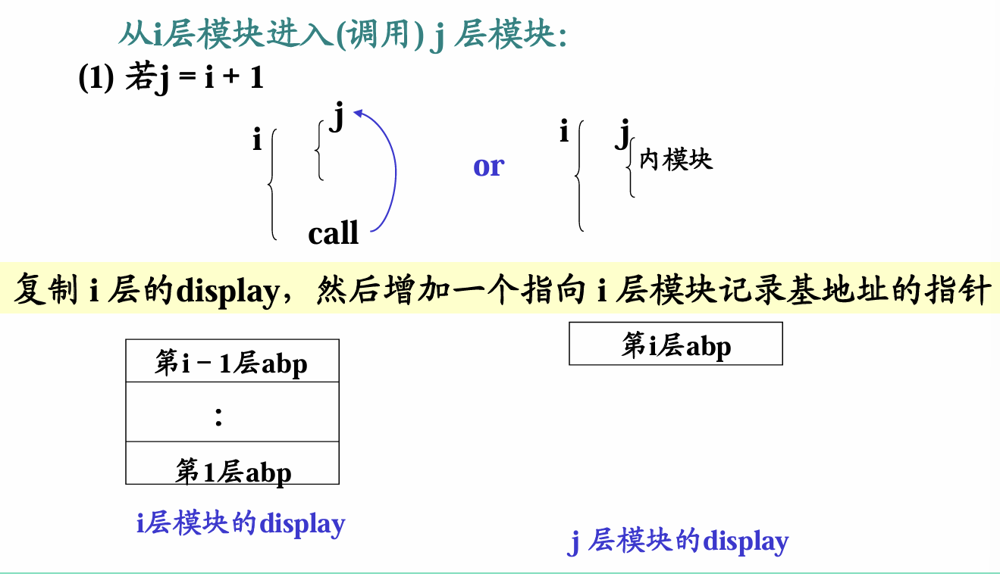
在前i-1层的基础上，在上面加第i层的abp
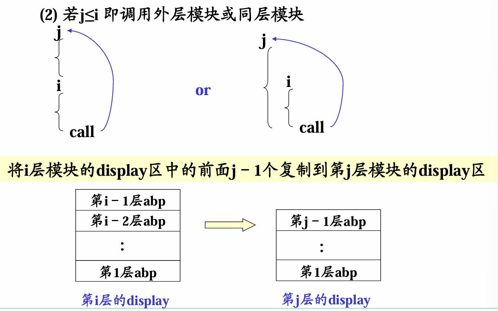

### 3.3 运行时地址计算

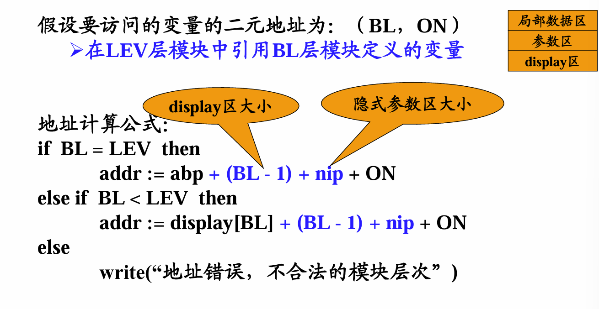
-1是因为当前在BL处。

C语言里AR叫栈帧
保存PC，压栈压的不是PC，而是PC+1，否则进入死循环了。

默认栈帧内初值是0xcccccccc，中文代表“烫”