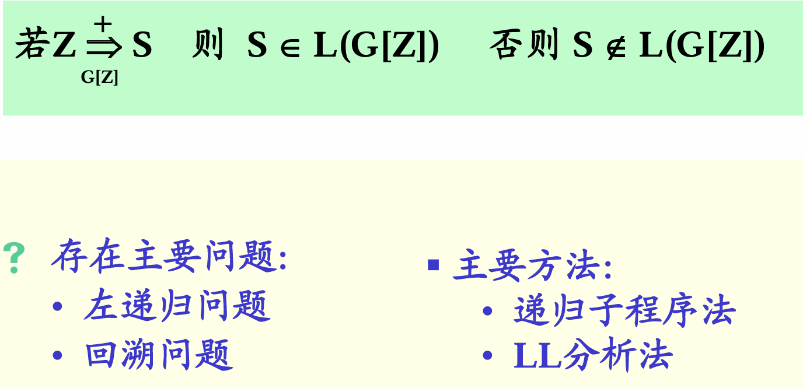
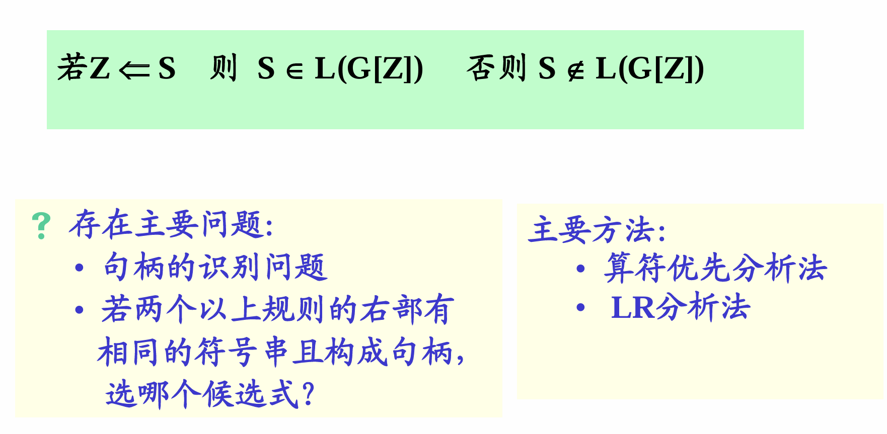
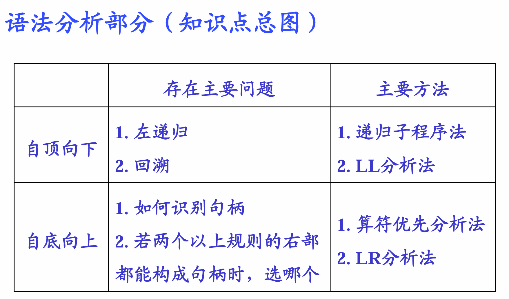
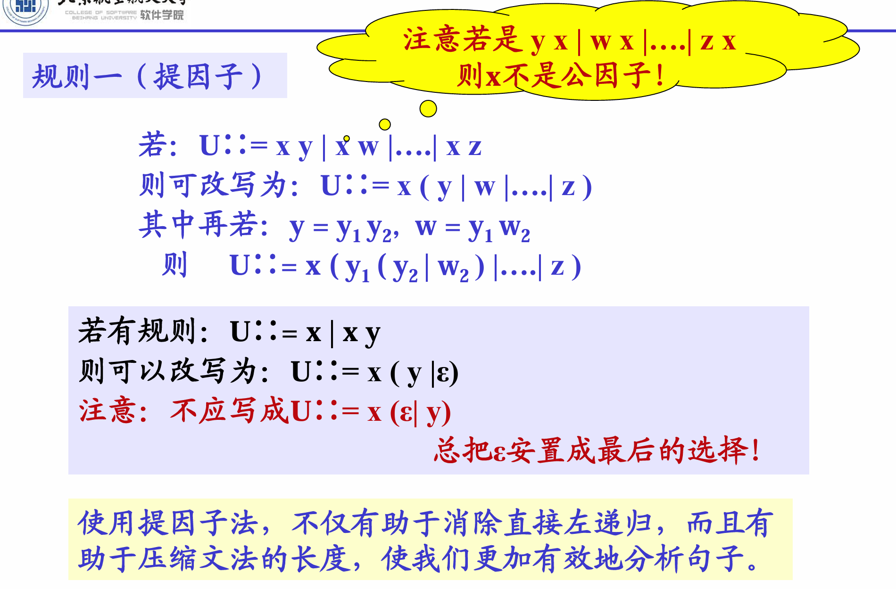
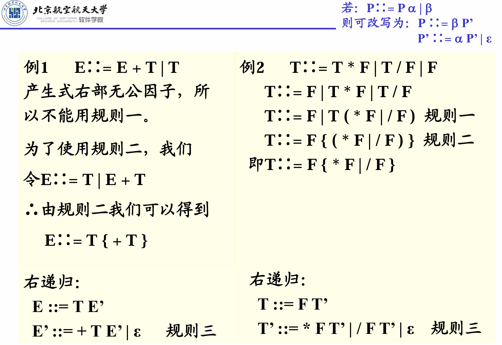
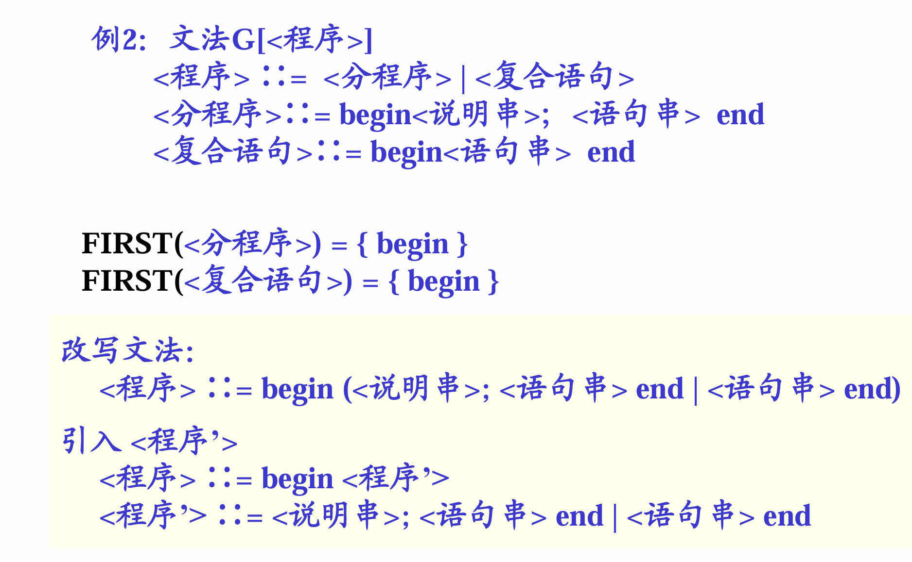
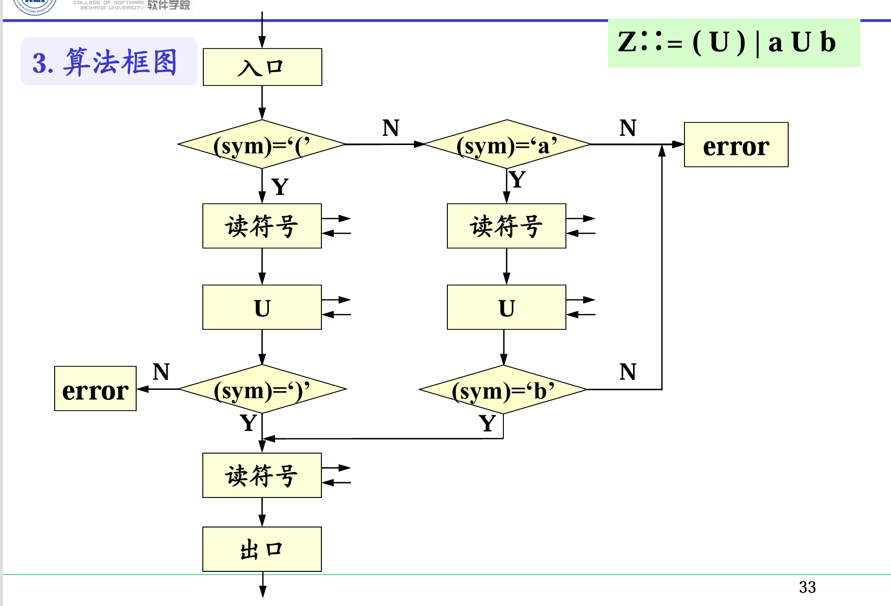
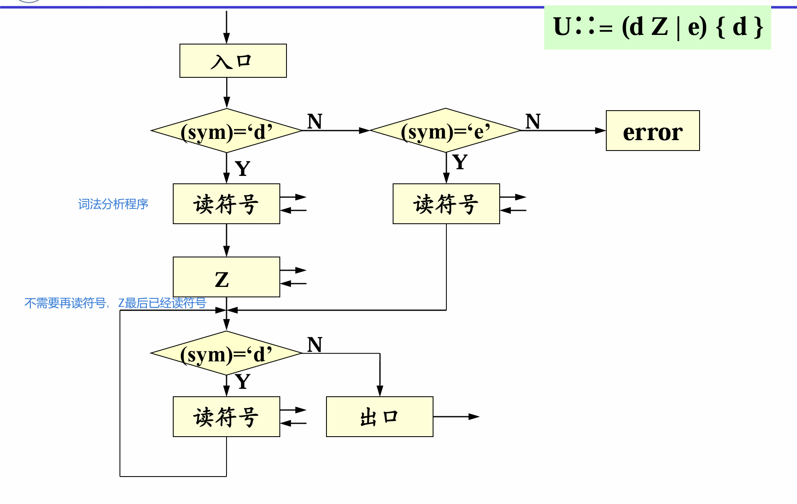

# 第四章 语法分析

## 1.  语法分析的功能、基本任务

**功能**：根据文法规则，从源程序单词符号串中识别出语法成分，并进行语法检查。
适用二型文法，上下文无关
**词法分析是三型文法**
词法分析是语法分析的一个组成部分。三型文法是二型的特例
考虑单词组成的字符串

自顶向下分析：（推导）

自底向上分析：（规约）

## 2. 自顶向下分析

建立语法树，看子节点是否和给出的字符串匹配。需要穷尽所有可能的情况。
### 2.1 存在的问题及解决

#### 1. 左递归文法：
自顶向下分析不能处理左递归。
左递归会一直建树，不会跳出来，陷入死循环
扫描句子从左至右扫描，不能左递归。
从右向左扫描，不能用右递归。

**消除左递归**
**方法一**：使用扩充的BNF表示来改写文法
例：(1) E∷= E + T | T             
=> E∷= T { + T }
 (2) T∷= T * F | T / F | F   
=>  T∷= F { * F | / F }

证明两者等价：证明语言集合是同一集合

**规则**：
1. 提左侧因子
   
   **从右向左扫描句子，则提右侧公因子**
2. 规则2
若有文法规则：U∷= x | y |…| z | U v
其特点是：具有一个直接左递归的右部并位于最后，这表明该语法类U是由x 或y…或z打头，其后跟随零个或多个v 组成。
U => Uv => Uvv => Uvvv =>……
 ∴可以改写为U∷= ( x | y |…| z ) { v }

**方法二**：将左递归规则改为右递归规则
规则三：
若：P∷= P $\alpha$ | $\beta$
则可改写为：P ∷= $\beta$P’
 P’ ∷= $\alpha$ P’ | ε

间接左递归的处理：非终结符顺序重新排列
1. 检查规则R是否存在直接左递归  R∷= S a | a
2. 把R代入Q的有关选择，改写规则Q      Q∷= S a b | a b | b
3. 检查Q是否直接左递归
4. 把Q代入S的右部选择   S∷= S a b c | a b c | b c | c
5. 消除S的直接左递归    S∷= ( a b c | b c | c ) { a b c }

#### 2. 回溯问题

分析工作要部分地或全部地退回去重做叫回溯。
文法中，对于某个非终结符号的规则其右部有多个选择，并根据所面临的输入符号不能准确地确定所要的产生式，就可能出现回溯。

解决：终结字符串的第一个Vt不相同（保证首字符不相同）
[定义]   设文法G（不具左递归性），U 属于Vn
 U::= α1 | α2 | α3
 FIRST(αi) = {a | αi => a…,   a 属于Vt }
为避免回溯，对文法的要求是:
 FIRST(αi) ∩ FIRST(αj) = φ  (i != j)
首字符集

**消除回溯问题**：
1. 改写文法，对具有多个右部的规则反复提取左因子
注意：问题到此并没有结束，还需要进一步检查V和W的首符号是否相交
若V∷= a b | c d       FIRST(V) = { a , c }
 W∷= d e | f g       FIRST(W) = { d , f }
只要不相交就可以根据输入符号确定目标；若相交，则要代入，并再次提取左因子。如：V::= a b      W::= a c
则：Z::= a ( b | c )

2. 超前扫描
当文法不满足避免回溯的条件时，即各选择的首符号相交时，可以采用超前扫描的方法，即向前侦察各输入符号串的第二个、第三个符号来确定要选择的目标。

#### 文法的两个条件

1. 文法是非左递归的；
2. 对文法的任一非终结符，若其规则右部有多个选择时，各选择所推出的终结符号串的首符号集合要两两不相交。

在上述条件下，就可以根据文法构造有效的、不带回溯的自顶向下分析器。

### 2.2 递归子程序法（递归下降分析法）

具体做法：对语法的每一个非终结符都编一个分析程序。当根据文法和当时的输入符号预测到要用某个非终结符去匹配输入串时，就调用该非终结符的分析程序。

递归子程序法对应的是最左推导过程！

一个非终结符对应一个子程序
主程序进入开始的程序。